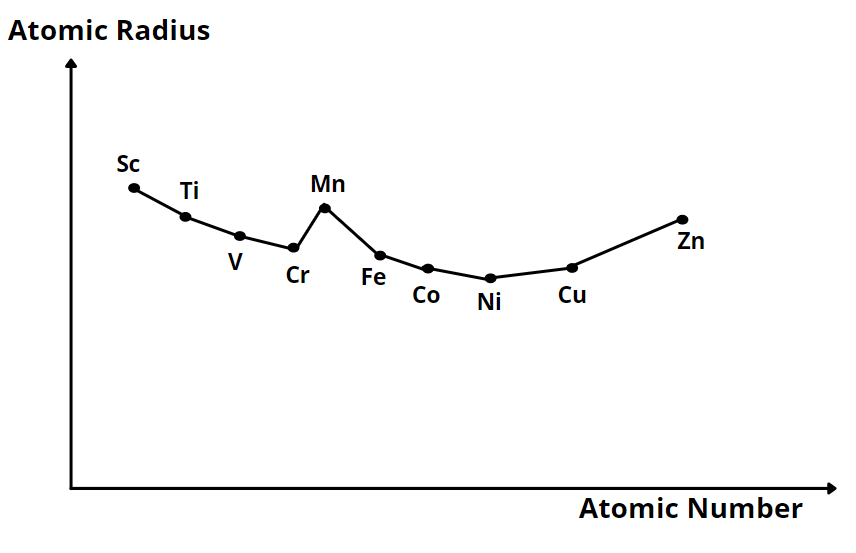

# [{ align=left, width=3.8% }](../../../index.md)  d-block Elements | Atomic and Ionic Sizes

## Atomic and Ionic sizes of d-block elements

* In general, the atomic and ionic radius decreased in 3d series with increase in atomic number.

* **Reason:** The new electron enters a d-orbital due to which nuclear charge increases. The shielding effect of a d-electron is not effective and hence the net electrostatic attraction between the nuclear charge and the outermost electron increases and the ionic radius decreases.

* The 4d and 5d series elements exhibit similar radii due to lanthonoid contraction.

!!! tip "Lanthanoid contraction"

    It occurs because of the poorest shielding effect of f-electrons. Lanthanoid contraction is associated with the intervention of the 4f-orbitals which must be filled before the
    5d-series of elements begin. The filling of 4f-orbitals before 5d-orbitals results in a regular decrease in atomic radii which essentially compensates for the expected increase in atomic size with increasing atomic number.

{loading=lazy}

## Density of d-block elements

* The decrease in metallic radius along with increase in atomic mass results in a general increase in density of these elements along the series.

!!! tip "Density"

    $$Sc < Ti < V < Zn < Cr < Mn < Fe < Co < Ni < Cu$$

## Questions

??? question "Zr belongs to 2nd d-series and Hf belongs to 3rd d-series but they have very similar physical and chemical properties. Why?"

    It is because they exhibit similar atomic radii due to lanthanoid contraction.

??? question "In the series from Ti (Z = 22) to Cu (Z = 29), copper has the highest density. Explain."

    It is because density increases in the series due to decrease in atomic radius and increase in atomic mass.
