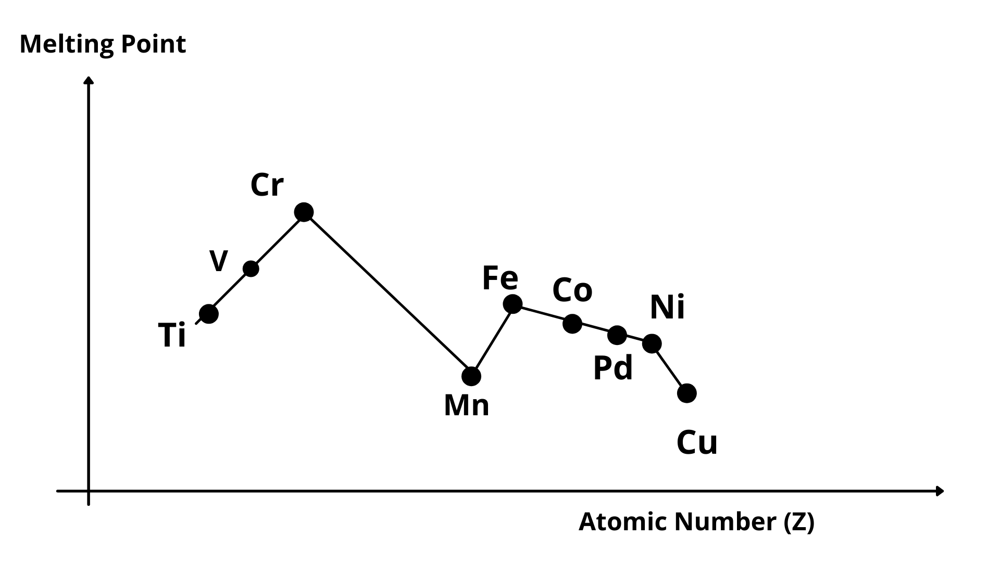
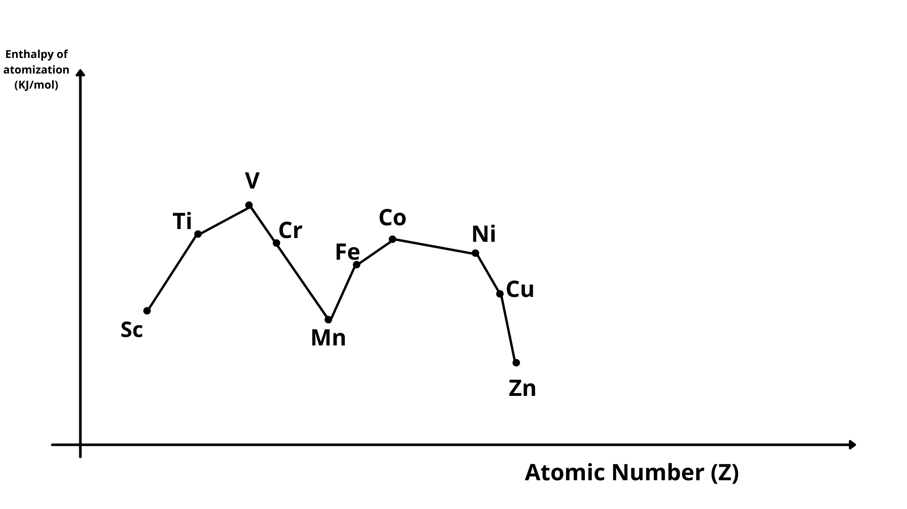

# [{ align=left, width=3.8% }](../../../index.md)  d-block Elements | Transition Elements and Their Physical Properties

* The d-block of the periodic table contains the elements of the groups 3-12 in which the d-orbitals are progressively filled in each of the four long periods.
* d-block consists of four series: 3d series, 4d series, 5d series and 6d series. 6d series is incomplete.
* In this chapter, we will mainly focus on 3d series of d-block elements.

## Transition Element

* A transition element is defined as the one which has incompletely filled d-orbitals in its ground state or in any of its oxidation states.
* The d-block element which has completely filled d-orbitals in ground state as well as in oxidation state cannot be classified as transition element. Example: Zinc

## Electronic Configuration

* General electronic configuration: (n-1)d1-10ns1-2

!!! tip "Exceptions in Electronic Configuration"

    * $Cr:\ 3d^54s^1$

    * $Cu:\ 3d^{10}4s^1$

    * $Hg:\ 5d^{10}6s^2$

    * $Cd:\ 4d^{10}5s^2$

* The electronic configuration of Zinc(Zn), Cadmium(Cd) and Mercury(Hg) is represented by the general formula (n-1)d10ns2.
* The d orbitals in Zn, Cd and Hg are completely filled in the ground state as well as in their common oxidation states. Therefore, they are not regarded as transition elements.
* Completely filled d-orbitals do not participate in bonding.

## Physical Properties of d-block elements

### 1. Metallic Properties

* High tensile strength, ductile, malleable, high thermal and electrical conductivity, metallic lustre, hard and low volatility.
* d-block elements are very hard except Cd, Hg and Zn.

### 2. Melting Points

* The melting points of d-block elements are high due to involvement of greater number of electrons (both from ns and (n-1)d orbitals) in inter-atomic metallic bonding.
* Cr has the highest melting point while Cu has the lowest melting point in 3d series.

{loading=lazy}

### 3. Metallic Bond

* 3d and 4d series elements of d-block are more frequent in forming metallic bonding due to high enthalpies of atomization and very high boiling point.

### 4. Enthalpy of Atomization

* The enthalpy change when one mole atoms of an element in gaseous state are formed from the most stable form of that element is known as enthalpy of atomization.
* Since d-block elements are strongly bonded by metallic bond, they have high enthalpy of atomization.
* Enthalpy of atomization of Zn is lowest as it has completely filled d-orbitals. Completely filled d-orbitals do not participate in bonding.

!!! tip ""

    $$Enthalpy\ of\ atomization &Proportional; Valence\ electrons\ in\ bonding$$

{loading=lazy}

## Questions

??? question "On what ground can you say that Scandium (Z = 21) is a transition element but zinc (Z = 30) is not?"

    On the basis of incompletely filled 3d orbitals in case of Scandium in its ground state (3d1), it is regarded as a transition element. On the other hand, Zinc atom has completely filled
    d-orbitals (3d10) in its ground state as well as in its oxidized state, hence it is not regarded as a transition element.

??? question "Silver atom has completely filled d-orbitals (4d10) in its ground state. How can you say that it is a transition element?"

    Silver is regarded as a transition element because it can exhibit +2 oxidation state which has incompletely filled d-orbitals.

??? question "Why do transition elements exhibit higher enthalpies of atomization?"

    Because of large number of unpaired electrons in their atoms, transition elements have stronger inter-atomic interactions and hence stronger bonding between atoms resulting in higher enthalpies of atomization.
