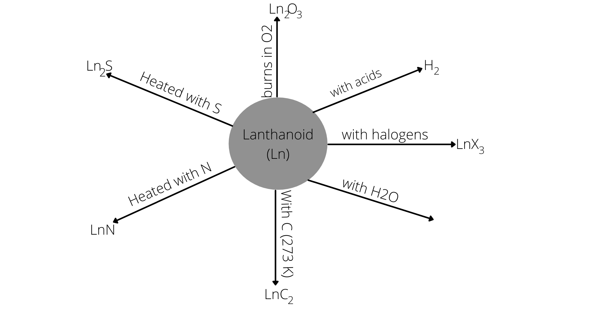

# [{ align=left, width=3.8% }](../../../index.md)  f-block Elements | Lanthanoids and their Properties

## Lanthanoids

* The fourteen elements following lanthanum are called lanthanoids.
* Because lanthanum closely resembles the lanthanoids, it is usually included in the discussion of lanthanoids.
* Promethium (Z=61) is the only lanthanoid which is radioactive.

## Electronic configuration of lanthanoids

* Atoms of these elements have electronic configuration with 6s2 common but with variable occupancy of 4f level.

!!! tip "General Electronic Configuration of lanthanoids"

    $$(n-2)f^{1-14}(n-1)d^{0-1}ns^{2},\ where\ n = 6$$

| Atomic Number | Name              | Electronic configuration                    |
|:-------------:|:-----------------:|:-------------------------------------------:|
| 57            | Lanthanum (La)    | 5d16s2                |
| 58            | Cerium (Ce)       | 4f15d16s2  |
| 59            | Praseodymium (Pr) | 4f36s2                |
| 60            | Neodymium (Nd)    | 4f46s2                |
| 61            | Promethium (Pm)   | 4f56s2                |
| 62            | Samarium (Sm)     | 4f66s2                |
| 63            | Europium (Eu)     | 4f76s2                |
| 64            | Gadolinium (Gd)   | 4f75d16s2  |
| 65            | Terbium (Tb)      | 4f96s2                |
| 66            | Dysprosium (Dy)   | 4f106s2               |
| 67            | Holmium (Ho)      | 4f116s2               |
| 68            | Erbium (Er)       | 4f126s2               |
| 69            | Thulium (Tm)      | 4f136s2               |
| 70            | Ytterbium (Yb)    | 4f146s2               |
| 71            | Lutetium (Lu)     | 4f145d16s2 |

## Atomic and Ionic Sizes

!!! tip "Lanthanoid Contraction"

    The overall decrease in atomic and ionic radii from lanthanum to lutetium is called lanthanoid contraction. For every additional proton in the nucleus, the corresponding electron
    goes into the 4f shell which is too diffused to screen the nucleus as effectively as more localized inner shell.

    **Consequence of lanthanoid contraction:** It causes the radii of the members of the third transition series to be very similar to those of the corresponding members of the second series.

## Oxidation States

* The most common oxidation state is +3. For lanthanum (La), it is +2.
* However, occasionally +2 and +4 ions in solution or in solid compounds are also obtained. This irregularity arises mainly due to extra stability of empty, half-filled or completely filled f-subshell.
* Cem Pm, Nd, Tb and Dy show both +3 and +4 oxidation states.
* Eu and Sm show both +2 and +3 oxidation states.
* Eu2+ is a strong reducing agent.
* Yb2+ which has f14 configuration is a reactant.
* TbIV has half filled f-orbital and is an oxidant.
* Ce4+ can oxidize water as the E0 value for Ce4+/Ce3+ is +1.74 V.

## Colour

* Many trivalent lanthanoids ions except La3+ and Lu3+ are coloured both in solid state and in aqueous solutions.
* Colour of these ions may be attributed to the presence of f-electrons. However, absorption bands are narrow probably because of the excitation within f-level.

## Magnetic Property

* The lanthanoid ions other than f0 type (La3+ and Ce4+) and the f14 type (Yb2+ and Lu3+) are all paramagnetic.
* The paramagnetism rises to maximum in neodymium(Nd).

## Chemical Reactions of Lanthanoids

{loading=lazy}

## Questions

??? question "Name a member of the lanthanoid series which is well known to exhibit +4 oxidation state."

    Cerium (Z = 58) is well known to exhibit +4 oxidation state.

??? question "Name two members of the lanthanoid series which exhibit: (a) +2 oxidation state (b) +4 oxidation state."

    (a) Europium (Z = 63) and Ytterbium (Z = 70)   (b) Cerium (Z = 58) and Neodymium (Z = 60)

??? question "Name a member of the lanthanoid series which has: (a) maximum paramagnetic property (b) no paramagnetic property."

    (a) Neodymium (Z = 60) has maximum paramagnetic property.   (b) La3+ and Ce4+ have no paramagnetic property.

??? question "Name a member of the lanthanoid series which is radioactive."

    Promethium (Z = 61) is the only lanthanoid, which is radioactive.
