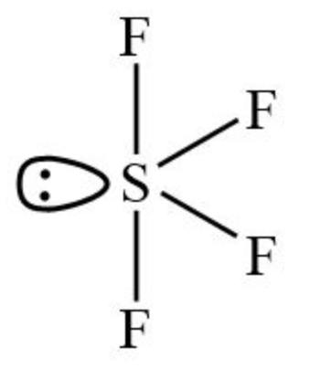

# [{ align=left, width=3.8% }](../../../index.md)  Group 16 Elements | Chemical Reactivity

## 1. Reactivity with Hydrogen:

* Group 16 elements react with hydrogen to form hydrides of the type H2E (E = O, S, Se, Te, Po).

### Properties of Hydrides:

* Their acidic character increases from H2O to H2Te due to decrease in bond enthalpy of H-E bond down the group.
* Thermal stability of hydrides decreases down H2O to H2>Po due to decrease in bond dissociation enthalpy of H2O to H2>Po.
* All the hydrides except water possess reducing property and this character increases from H2S to H2>Te.

## 2. Reactivity with Oxygen:

* All these elements form oxides of the EO2 and EO3 types (E = S, Se, Te, Po).

### Properties of Oxides:

* **Physical state:** Ozone(O3) and sulphur dioxide (SO2) are gases while selenium dioxide (SeO2) is solid.
* **Reducing property:** Reducing property of dioxide decreases from SO2 to TeO2. SO2 is a reducing agent while TeO2 is an oxidizing agent.
* Besides EO2 type, sulphur, selenium and tellurium also form EO3 type oxides (SO3, SeO3, TeO3).
* **Acidic character:** Both EO2 and EO3 type oxides are acidic in nature.

## 3. Reactivity towards the Halogens:

* Elements of Group 16 form a large number of halides of the type: EX6, EX4 and EX2, where E is an element of group 16 and X is a halogen.
* The stability of halides decreases in the order F- > Cl- > Br- > I-. Amongst hexahalides, hexafluorides are the only stable halides.
  All hexafluorides are gaseous in nature They have octahedral structure. Sulphur hexafluoride, SF6, is exceptionally stable for steric reasons.
* Amongst tetrafluorides, SF4 is a gas, SeF4 is a liquid and TeF4 is a solid. These fluorides have sp3d hybridisation. Their geometry is Trigonal bipyramidal and shape is see-saw.
  {loading=lazy}
* All the elements except selenium form dichlorides and dibromides. These halides are formed by sp3 hybridisation and have tetrahedral structure.
* The well known monohalides are dimeric in nature. These dimeric halides undergo disproportionation as below:

  $$2Se_2Cl_2 &rarr; SeCl_4 + 3Se$$
