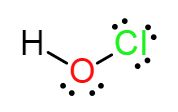
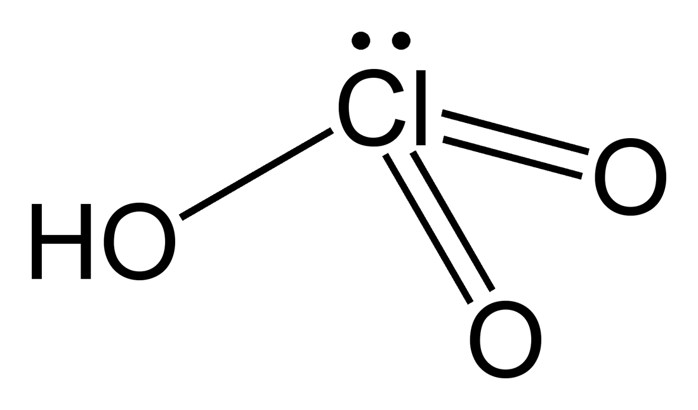
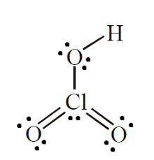
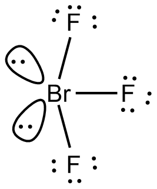

# [{ align=left, width=3.8% }](../../../index.md)  Group 17 Elements | Oxoacids and Interhalogen Compounds

## Oxoacids of Halogens

* An oxoacid can be defined as an acid that contains oxygen and atleast one other element and atleast one hydrogen atom bonded to oxygen.

Acid                            |	Fluorine                |	Chlorine                            |	Bromine	                              |    Iodine                          |
--------------------------------|-------------------------|-------------------------------------|---------------------------------------|------------------------------------|
Halic(I) acid (Hypohalous acid) |	HOF (Hypofluorous acid) |	HOCl (Hypochlorous acid)            | HOBr (Hypobromous acid)               |    HOI (Hypoiodous acid)           |
Halic(III) acid (Halous acid)   |	-	                      | HOClO (Chlorous acid)               |	-	                                    |      -                             |
Halic(V) acid (Halic acid)      |	-	                      | HOClO2 (Chloric acid)    |	HOBrO2 (Bromic acid)       |	HOIO2 (Iodic acid)      |
Halic(VII) acid (Perhalic acid) |	-	                      | HOClO3 (Perchloric acid) | HOBrO3 (Perbromic acid)    |	HOIO3 (Periodic acid)   |

## Structures of oxoacids

!!! tip "Structures of oxoacids"

    #### 1. Hypochlorous acid (HOCl)

    {loading=lazy}

    #### 2. Chlorous acid (HOClO)

    {loading=lazy}

    #### 3. Chloric acid (HOClO2)

    {loading=lazy}

    #### 4. Perchloric acid (HOClO3)

    {loading=lazy}

## Interhalogen Compounds

Halogens combine amongst themselves to form a number of compounds known as interhalogens of the type XX', XX'3, XX'5, XX'7, where X is a large size
halogen and X' is a small size halogen.

#### 1. Preparation of interhalogen compounds

* Interhalogen compounds are prepared by direct combination of halogens under specific conditions.

!!! tip ""

    $$At\ 437\ K:\ Cl_2 + F_2 &rarr; 2ClF$$

    $$[Cl_2\ and\ F_2\ are\ in\ equal\ volume]$$

    $$At\ 573\ K:\ Cl_2 + 3F_2 &rarr; 2ClF_3$$

    $$[F_2\ is\ in\ excess]$$

    $$I_2 + Cl_2 &rarr; 2ICl$$

    $$[I_2\ and\ Cl_2\ are\ equimolar]$$

    $$I_2 + 3Cl_2 &rarr; 2ICl_3$$

    $$[Cl_2\ is\ in\ excess]$$

    $$Br_2 + 3F_2 &rarr; 2BrF_3$$

    $$[F_2\ is\ diluted\ with\ water]$$

    $$Br_2 + 5F_2 &rarr; 2BrF_5$$

    $$[F_2\ is\ in\ excess]$$

#### 2. Properties of Interhalogen compounds

* Interhalogen compounds are all covalent molecules and are diamagnetic in nature.
* These are volatile solids or liquids at 298 K except ClF which is a gas.
* Interhalogen compounds are more reactive than halogens (except fluorine) because X-X' bond in interhalogens is weaker than X-X bond in halogens ecxcept F-F bond.

Type            |	Formula            |	Physical state and colour           |	 Structure              |
----------------|--------------------|--------------------------------------|-------------------------|
XX'	            | ClF	               | Colourless Gas                       |	 -                      |
XX'	            | BrF	               | Pale brown gas	                      |  -                      |
XX'             |	IF	               | Detected spectroscopically           |	 -                      |
XX'	            | BrCl	             |   Gas	                              |  -                      |
XX'             |	ICl                |	 Solid                              |	 -                      |
XX'3 |	ClF3    |	Colourless Gas                      |	 Bent T-shaped          |
XX'3	| BrF3    | Yellow green	                        |  Bent T-shaped          |
XX'3	| IF3     |	Yellow Powder	                      |  Bent T-shaped          |
XX'3	| ICl3    |	Orange solid	                      |  Bent T-shaped          |
XX'5	| IF5     |	Colourless gas but solid below 77 K |	 Square Pyramidal       |
XX'5	| BrF5    |	Colourless liquid	                  |  Square Pyramidal       |
XX'5	| ClF5    |	Colourless liquid	                  |  Square Pyramidal       |
XX'7	| IF7     |	Colourless gas                      |	 Pentagonal bipyramidal |

#### Uses of interhalogen compounds

* Interhalogen compounds are used as fluorinating agents. For example, ClF3 and BrF3 are used to prepare UF6.

!!! tip ""

    $$U_{(s)} + 3ClF_{3(l)} &rarr; UF_{6(g)} + 3ClF_{(g)}$$

* Interhalogen compounds are used as non-aqueous solvents.

## Question

!!! question "Discuss the molecular shape of BrF3 on the basis of VSEPR theory."

    The structure of BrF3 is:

    {loading=lazy}

    **Geometry:** Trigonal bipyrmaidal, **Shape:** Bent T-shaped, **Hybridization:** sp3d
