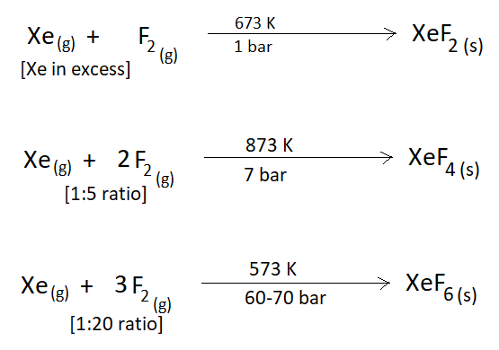
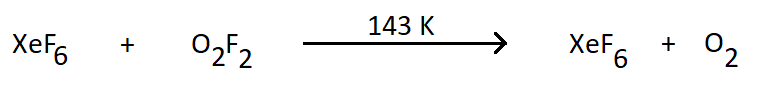
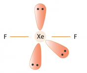
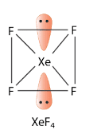
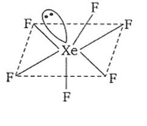
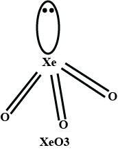
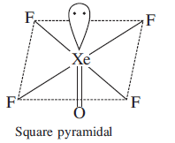

# [{ align=left, width=3.8% }](../../../index.md)  Group 18 Elements | Chemical Properties

## Introduction

The inertness of noble gases is attributed to the following reasons:

* The noble gases have completely filled electronic configuration in their valence shell.
* They have high ionization enthalpy and more positive electron gain enthalpy.

In 1962, Neil Bartlett observed the reaction of noble gases. First he prepared a red compound which is formulated as O2+PtF6-. He, then realized that the first ionization enthalpy
of molecular oxygen was almost identical to that of Xenon. He was successful in preparing another compound Xe+PtF6- by mixing PtF6 and Xenon.
After this discovery, a number of xenon compounds mainly with most electronegative elements like fluorine and oxygen have been synthesized.

!!! tip "Some important points"

    * The compounds of Krypton are fewer, example: KrF2.
    * Compounds of Radon have not been isolated but only identified (Ex: RnF2) by radiotracer technique.
    * Helium is used as a diluent for oxygen in modern diving apparatus because of its very low solubility in blood.

## 1. Xenon-fluorine Compounds

* Xenon forms three binary fluorides, XeF2, XeF4 and XeF6 by the direct reaction of elements under appropriate experimental conditions.

!!! tip ""

    {loading=lazy}

* XeF6 can also be prepared by the interaction of XeF4 and O2F2 at 143 K.

!!! tip ""

    {loading=lazy}

* Xenon-fluorine compounds are powerful fluorinating agents. They are readily hydrolyzed even by traces of water.

!!! tip ""

    $$2XeF_{2(s)} + 2H_2O_{(l)} &rarr; 2Xe_{(g)} + 4HF_{(g)} + O_{2(g)}$$

* Xenon fluorides react with fluoride ion acceptors to form cationic species and fluoride ion donors to form fluoroanions.

!!! tip ""

    $$XeF_2 + PbF_5 &rarr; [XeF]^+ [PbF_6]^-$$

    $$XeF_4 + SbF_5 &rarr; [XeF_3]^+ [SbF_6]^-$$

    $$XeF_6 + MF &rarr; M^+ [XeF_7]^-$$

    $$Here,\ M = Na,\ K,\ Rb\ or Cs$$

### Structures of Xenon-fluorine Compounds:

!!! tip "Structure of XeF2 (Linear)"

    {loading=lazy}

!!! tip "Structure of XeF4 (Square Planar)"

    {loading=lazy}

!!! tip "Structure of XeF6 (Distorted Octahedral)"

    {loading=lazy}

## 2. Xenon-Oxygen Compounds

* Hydrolysis of XeF4 and XeF6 with water gives XeO3.

!!! tip ""

    $$6XeF_4 + 12H_2O &rarr; 4Xe + 2XeO_3 + 24HF + 3O_2$$

    $$XeF_6 + 3H_2O &rarr; XeO_3 + 6HF$$

* Partial hydrolysis of XeF6 gives oxyfluorides, XeOF4 and XeO2F2.

!!! tip ""

    $$XeF_6 + H_2O &rarr; XeOF_4 + 2HF$$

    $$XeF_6 + 2H_2O &rarr; XeO_2F_2 + 4HF$$

!!! tip "Structure of XeO3 (Pyramidal structure)"

    {loading=lazy}

!!! tip "Structure of XeOF4 (Square Pyramidal structure)"

    {loading=lazy}

## Questions

??? question "What inspired N. Bartlett for carrying out reaction between Xe and PtF6?"

    N. Bartlett found that the first ionization enthalpy of molecular oxygen and xenon are almost identical. He first prepared a compound O2+PtF6- and then
    successfully prepared Xe+PtF6- at 278 K.

    $$Xe + PtF_6 &rarr; Xe^+PtF_6^-$$

??? question "Why is helium gas used in diving apparatus?"

    It is used in diving apparatus because of its very low solubility in blood.

??? question "Balance the reaction: XeF6 + H2O &rarr; XeO2F2 + HF"

    XeF6 + 2H2O &rarr; XeO2F2 + 4HF

??? question "Does the hydrolysis of XeF6 lead to a redox reaction?"

    No, the products of hydrolysis are XeOF4 and XeO2F2 where the oxidation states of all the elements remain same as it was in the reacting state.

