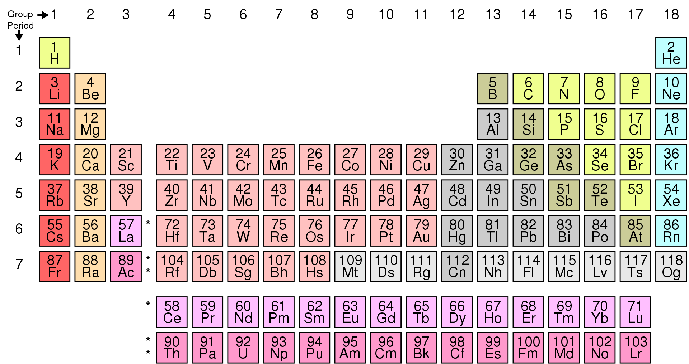
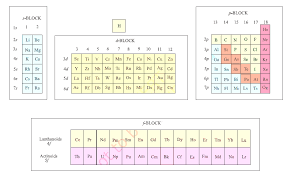

# [{ align=left, width=3.8% }](../../index.md)  Periodicity | Electronic configuration and periodic table

* We can predict the properties of an atom by seeing its electronic configuration. Thus, electronic configuration and periodic table are closely related.
  
* There are a set of four quantum numbers, which determine the characteristic of an atom. For details on these quantum numbers, please go through this [link](https://en.wikipedia.org/wiki/Quantum_number){:target="_blank"}.

* The principal quantum number (n) defines the main energy level known as shell.

* The distribution of electrons of an atom in different sub-shells (or orbitals), ie, s, p, d and f orbitals is known as its electronic configuration.

* An element's location in the Periodic Table reflects the quantum numbers of the last orbital filled.

Image Credit: [https://en.wikipedia.org/wiki/Periodic_table](https://en.wikipedia.org/wiki/Periodic_table){:target="_blank"}

## Electronic configuration in Periods

* The period refers to the value of n (principal quantum number) for the outermost shell, also known as valence shell.

* For example, electronic configuration of Neon is 1s22s22p6. From the electronic configuration, the value of n for valence shell is 2. We can also see from periodic table that Neon is placed in period 2.

* The elements from Z=21 to Z=30 are known as 3d **transition elements** because 3d orbitals are filled in these atoms. For example, electronic configuration of Sc = 1s22s22p63s23p64s23d1.

* Please note that filling of 3d orbital is more energetically favourable than 4p orbital. So, 3d orbital is filled before 4p orbital.

* Similarly, elements from Z=39 to Z=48 are known as 4d **transition elements**.

* Filling up of the 4f orbitals begins with cerium (Z = 58) and ends at lutetium (Z = 71) to give the 4f-inner transition series which is called the lanthanoid series.

* Filling up of the 5f orbitals after actinium (Z = 89) gives the 5f-inner transition series known as the actinoid series.

* The 4f and 5f-inner transition series of elements are placed separately in the Periodic Table to maintain its structure and to preserve the principle of classification by keeping elements with similar properties in a single column.

??? question "How would you justify the presence of 18 elements in the 5th period of the Periodic Table?"

    For n = 5, l = 0, 1, 2, 3. Here, l refers to azimuthal quantum number.
    
    General Electronic configuration of element in group 5 is:
    
    1s22s22p63s23p63d104s24p65s1-24d1-105p1-6
    
    We can see that 5s can accommodate a maximum of 2 electrons, 4d can have a maximum of 10 electrons and 5p can have 6 at most electrons.
                
    Thus, the number of electrons contained in the valence shell is at most 18, which justifies the presence of 18 elements in the 5th period of the Periodic Table.

## Groupwise Electronic Configurations

* Elements in the same vertical column or group have similar valence shell electronic configurations, the same number of electrons in the outer orbitals, and similar properties.

* The elements in a vertical column of the Periodic Table constitute a group or family and exhibit similar chemical behaviour. This similarity arises because these elements have the same number and same distribution of electrons in their outermost orbitals.

* We can classify the elements into four blocks viz., s-block, p-block, d-block and f-block depending on the type of atomic orbitals that are being filled with electrons.

* We notice two exceptions to this categorisation. Strictly, helium belongs to the s-block but its positioning in the p-block along with other group 18 elements is justified because it has a completely filled valence shell (1s2) and as a result, exhibits properties characteristic of other noble gases.

* The other exception is hydrogen. It has only one s-electron and hence can be placed in group 1 (alkali metals). It can also gain an electron to achieve a noble gas arrangement and hence it can behave similar to a group 17 (halogen family) elements.