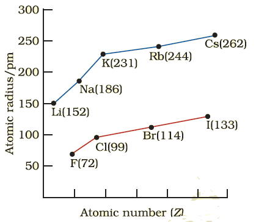
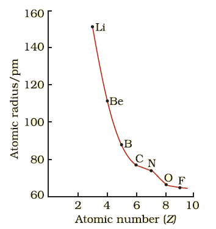
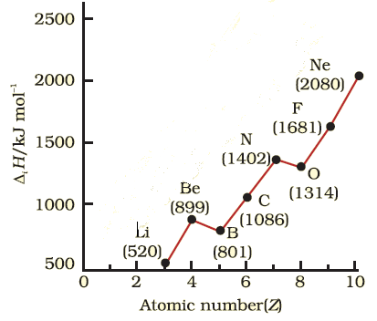
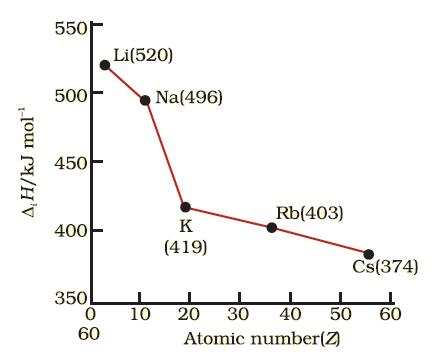

# [{ align=left, width=3.8% }](../../index.md)  Periodicity | Trends in physical properties

There are many patterns and trends in physical properties of elements which can be observed in the periodic table.

Image Credit: [https://en.wikipedia.org/wiki/Periodic_table](https://en.wikipedia.org/wiki/Periodic_table){:target="_blank"}

## Trends in atomic radius

* Measuring the radius of an atom is a complicated process.
* For covalent single bonded molecules, the size of atom is the molecular distance between them. This is known as covalent radius.
* Metallic radius is half the internuclear distance separating the metal cores in the metallic crystal.
* In this article, we will refer both types of radii as atomic radii for simplicity.
* The atomic radius increases down the group because of addition of new shells as we move down the group.

* The atomic radius decreases across the period because within the period the outer electrons are in the same valence shell and the effective nuclear charge increases as the atomic number increases resulting in the increased attraction of electrons to the nucleus.

* Atomic radius of noble gas is very large because being monoatomic, their non-bonded radius value is very high.

## Trends in ionic radius

* The removal of electron(s) from an atom leads to formation of a cation and addition of electron(s) to an atom leads to formation of an anion.
* Ionic radius can be estimated by measuring distance between cation and anion in an ionic crystal.
* Similar to atomic radius, ionic radius increases down the group and decreases across a period.
* Anions are larger than the parent atoms because the addition of one or more electrons increases repulsion among electrons causing decrease in effective nuclear charge. For example, Cl- is larger than Cl.
* Cations are smaller than the parent atoms because they have fewer electrons but have same nuclear charge. For example, K+ is smaller than K.
* **Isoelectronic species:** Atoms or ions with same number of electrons are known as isoelectronic species. Example: O2-, F-, Na+ and Mg2+ are isolectronic species with 10 electrons each.
* For isoelectronic species, anions with larger negative charge will have larger radius as compared to anions with smaller negative charge and cations with smaller positive charge will have higher radius as compared to cations with larger positive charge.

??? question "Which of the following species will have the largest and the smallest size?  Mg, Mg2+, Al, Al3+"

    Atomic radius decreases across a period. Size of cation is smaller than parent atom and among isoelectronic species, cation with lower positive charge has larger radius. Hence, largest species is Mg and smallest species is Al3+.

## Ionization Enthalpy

* The energy required to remove an electron from an isolated gaseous atom in its ground state is known as ionization enthalpy. It is depicted by &Delta;iH. It is expressed in Kilojoule per mole (KJ mol-1)
* It is the quantitative measure of the tendency of an atom to lose electron.
* Energy is always required to remove electron(s) from an atom. Hence, it is always positive.
* First ionization enthalpy is the energy required to remove first outermost electron from an atom.

!!! tip ""

    $$X(g) &rarr; X^+(g) + e^-$$

* Second ionization enthalpy is the energy required to remove second outermost electron from a cation (with +1 charge) in gaseous state.
  
!!! tip ""

    $$X^+(g) &rarr; X^{2+}(g) + e^-$$

* The second ionization enthalpy will be higher than the first ionization enthalpy because it is more difficult to remove an electron from a positively charged ion than from a neutral atom. In the same way the third ionization enthalpy will be higher than the second and so on. The term "ionization enthalpy", if not qualified, is taken as the first ionization enthalpy.

* Generally, first ionization enthalpy or ionization enthalpy increases across a period because of the increase in effective nuclear charge while shielding effect of inner electrons remain the same. Hence, the outer electrons are held tightly.

* The shielding or screening of outer electrons from the nucleus by the inner electrons is known as shielding effect. Generally, shielding effect is more effective when inner shells are completely filled.

* Shielding effect is generally more powerful in alkali metals and alkaline earth metals because of noble gas configuration in inner shells. Hence, they readily lose electrons.

* From the graph, we can see that the first ionization enthalpy of boron is slightly less than beryllium although boron has higher nuclear charge. When we consider the same principal quantum level, an s-electron is attracted to the nucleus
  more than a p-electron. In beryllium, the electron removed during the ionization is an s-electron whereas the electron removed during ionization of boron is a p-electron. The penetration of a 2s-electron to the nucleus is
  more than that of a 2p-electron; hence the 2p electron of boron is more shielded from the nucleus by the inner core of electrons than the 2s electrons of beryllium.

* We can observe another exception in the graph. The first ionization enthalpy of oxygen is less than nitrogen. This arises because in the nitrogen atom, three 2p-electrons reside in different atomic orbitals (Hund's rule) whereas
  in the oxygen atom, two of the four 2p-electrons must occupy the same 2p-orbital resulting in an increased electron-electron repulsion. Consequently, it is easier to remove the fourth 2p-electron from oxygen than it is, to remove
  one of the three 2p-electrons from nitrogen.

* Electron gain enthalpy decreases down the group because outermost electrons get farther from the nucleus making them easier to remove.

## Electron Gain Enthalpy

* When a gaseous atom in ground state gains an electron, energy is absorbed or released. This is known as electron gain enthalpy. It is represented by &Delta;egH.
* Electron gain enthalpy can be positive or negative. If the reaction is endothermic (i.e, energy is required to perform the reaction), electron gain enthalpy is positive. When the reaction is exothermic (ie, energy is
  released during the reaction), it is negative.

!!! tip ""

    $$X(g) + e^- &rarr; X^-(g)$$

* Electron gain enthalpy variation is less systematic in the periodic table as compared to ionization enthalpy.
* Generally, electron gain enthalpy becomes more negative as we move across the period and becomes less negative as we go down the group.
* Electron gain enthalpy becomes more negative across a period because effective nuclear charge increases and it is easier to add an electron to the atom.
* Electron gain enthalpy becomes less negative down the group because the size of atom increases down the group and added electron will be farther from nucleus.
* Electron gain enthalpy of noble gases is very high because they have stable electronic configuration and addition of electron will lead to very unstable electronic configuration.

* **Exception:** Electron gain enthalpy of fluorine is less negative than chlorine. Also, electron gain enthalpy of oxygen is less negative than sulphur. This is because in case of fluorine and oxygen, electron
  is added to 2p orbital leading to more electron-electron repulsion.

## Electronegativity

* Electronegativity is the ability of an atom to attract shared pair of electrons towards itself.
* It is not quantitative, ie, it cannot be measured. It is qualitative. However, there are a number of numerical scales used to depict electronegativity like Pauling scale.

### Pauling Scale:

<table>
    <tbody>
        <tr>
            <td><strong>Atom (Period II)</strong></td>
            <td>Li</td>
            <td>Be</td>
            <td>B</td>
            <td>C</td>
            <td>N</td>
            <td>O</td>
            <td>F</td>
        </tr>
        <tr>
            <td><strong>Electronegativity</strong></td>
            <td>1.0</td>
            <td>1.5</td>
            <td>2.0</td>
            <td>2.5</td>
            <td>3.0</td>
            <td>3.5</td>
            <td>4.0</td>
        </tr>
        <tr>
            <td><strong>Atom (Period III)</strong></td>
            <td>Na</td>
            <td>Mg</td>
            <td>Al</td>
            <td>Si</td>
            <td>P</td>
            <td>S</td>
            <td>Cl</td>
        </tr>
        <tr>
            <td><strong>Electronegativity</strong></td>
            <td>0.9</td>
            <td>1.2</td>
            <td>1.5</td>
            <td>1.8</td>
            <td>2.1</td>
            <td>2.5</td>
            <td>3.0</td>
        </tr>
    </tbody>
</table>

* Electronegativity increases across a period because size of atom decreases and shared electron is more closer to nucleus.
* Electronegativity decreases down the group because size of atom increases and shared electron is farther from the nucleus.
* The electronegativity of any given element is not constant; it varies depending on the element to which it is bound.
* Electronegativity is also directly proportional to non-metallic characteristic of an element. Therefore, non-metals have high electronegativity and metals have low electronegativity.

