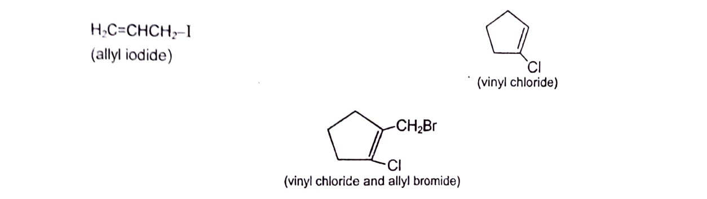
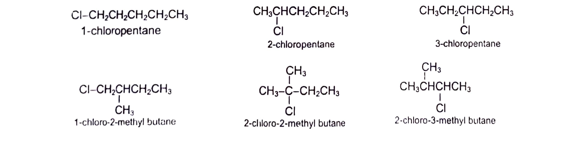
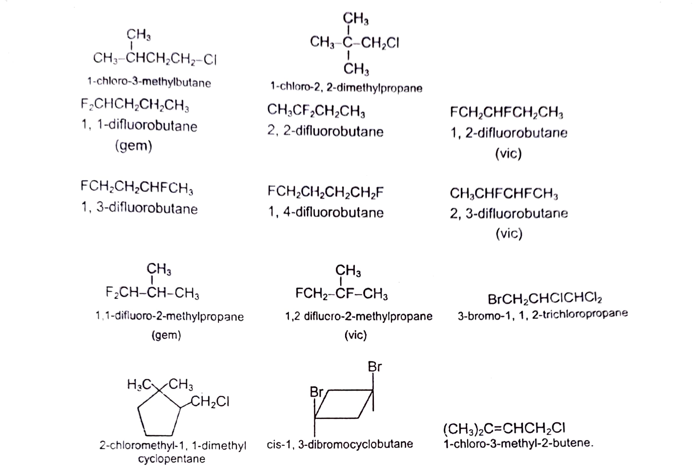

# [{ align=left, width=3.8% }](../../index.md)  Alkyl Halides | Introduction and Nomenclature

## Introduction

Alkyl halides are halogen substituted alkanes. A monohaloalkane is written as R-X, where X is any halogen atom (F, Cl. Br and l).

The general formula of monohaloalkanes is CnH2n+1X while that of a dihaloalkane is CnH2nX2.

Alkyl halides of a particular kind, in which halogen atom is attached to a saturated carbon, which in turn is linked to unsaturated carbon, are called allyl halides. And when halogen atom is attached to an unsaturated (sp2) carbon, they are called vinyl halides.

!!! example "Examples"

    {loading=lazy}

Alkyl halides are classified as primary (10), secondary (20) or tertiary (30), depending upon the type of carbon to which X is bonded. When X is bonded to a carbon which is bonded to one more carbon, it is called 10 halide and their general representation is RCH2X.
When X is linked to a carbon which is bonded to two carbons, it is called 20 halides and is denoted by R2CHX. When X is bonded to a carbon, which is attached to 3 carbons is called 30 halides and is designated as R3CX.
CH3X is unique (not classified as 10 , 20 or 30) as carbon is bonded to only hydrogens and is simply called methyl halide. Dihaloalkanes with both halogens on same carbon are called gemdihalides and with halogen on adjacent carbons are called vicinal dihalides.

## IUPAC Nomenclature of Alkyl halides

IUPAC nomenclature of alkyl halides with one halogen is haloalkanes and with tvvo similar halogens is dihaloalkanes. If the halogens present are different, they are prefixed in alphabetical order.

!!! example "Examples"

    {loading=lazy}

    {loading=lazy}
