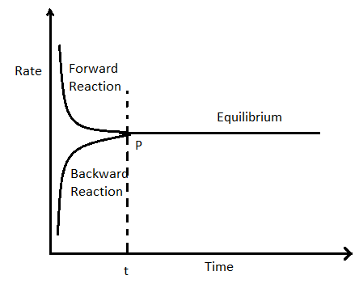

# [{ align=left, width=3.8% }](../../index.md)  Chemical Equilibrium | Introduction

## Equilibrium State

* Equilibrium is defined as the state of a system in which the measurable properties of a system like colour,
  concentration, pressure etc become constant. 
* There are two types of equilibrium: (a) Physical equilibrium (b) Chemical equilibrium. 
* Equilibrium involving physical processes is called physical equilibrium.

!!! example "Examples of physical equilibrium"

    (i) Melting of solids (solid &#8652; liquid).

    (ii) Vaporization of liquids (Liquid &#8652; Gas). 

* Equilibrium involving chemical processes is called chemical equilibrium.

!!! example "Example of chemical equilibrium"

    N2 + 3H2 &#8652; 2NH3

## Characteristics of chemical equilibrium

* Chemical equilibrium can be achieved in reversible reactions only because reversible reactions can occur in both forward and backward directions while irreversible reactions occur only in one direction.
* Equilibrium can only be achieved in a closed container, ie, products should not be allowed to escape.

!!! example "Example"

    $$CaCO_{3(s)} &#8652; CaO_s + CO_{2(g)}$$

    If the container is open in this reaction, then CO2 will escape and reaction will not move in backward direction. Thus, equilibrium will never be achieved.

* Equilibrium can be achieved from both product and reactant sides.

!!! example "Example"

    $$CaCO_{3(s)} &#8652; CaO_s + CO_{2(g)}$$

    We can achieve equilibrium by decomposing CaCO3 or by starting reaction with CaO and CO2 in a closed container.

* The concentration of reactants decreases and that of products increases and both become constant at equilibrium. It should be noted that the concentration of reactants and products may or may not be equal at equilibrium
  but they are always constant at equilibrium.

At point P, the concentration of both reactants and products are equal but equilibrium has not been achieved. At time = t, equilibrium is achieved.

* The rate of forward reaction decreases and that of backward reaction increases and both become equal at equilibrium.

At point P, rate of forward reaction becomes equal to that of backward reaction and equilibrium has been achieved.

!!! tip "Key Point"

    At equilibrium, concentration of products and reactants are constant (but may or may not be equal) and rates of forward and backward reactions are equal.

* Chemical equilibrium is dynamic in nature, ie, none of the forward and backward reactions stop. Both forward and backward reactions occur at the same rate.