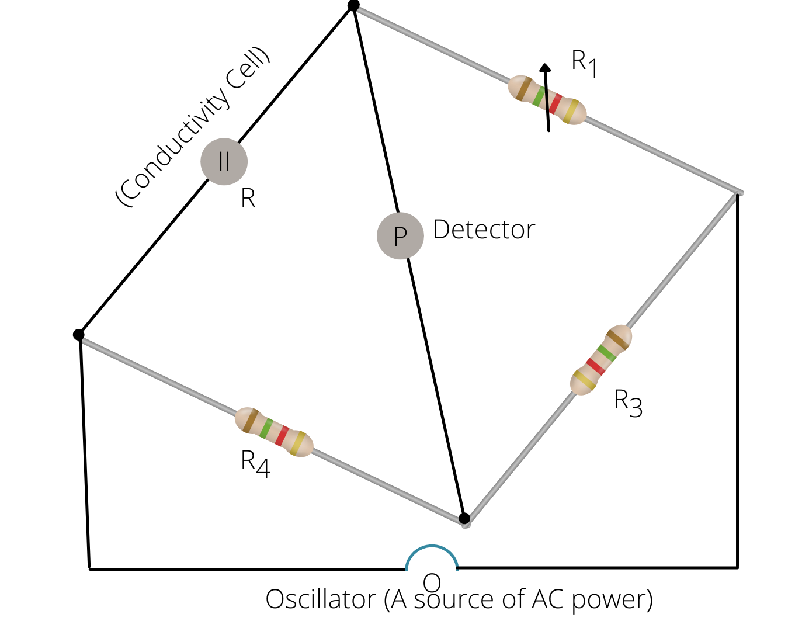

# [{ align=left, width=3.8% }](../../index.md)  Electrochemistry | Conductance of Electrolytic Solutions

## Resistance

* The electrical resistance is directly proportional to the length of conductor, l and inversely proportional to its cross-sectional area, A.

!!! tip ""

    $$R &Proportional; l$$

    $$R &Proportional; {1 \over A}$$

    $$ &Therefore; R &Proportional; {l \over A}$$

    $$ &Therefore; R = {&rho; l\over A}$$

## Resistivity

* Resistivity of a substance is its resistance when it is one metre long and its area of cross-section is one sq. metre.
* It is also known as specific resistance.
* Its S.I. unit is ohm-metre (&ohm;m).

## Conductance

* The inverse of resistance, R is known as conductance, G. Its S.I. unit is ohm-1 (&ohm;-1) or mho or siemens (S).

!!! tip ""

    $$G = {1 \over R}$$

    $$G = {1 \over &rho;} {A \over l}$$

    $$ &Therefore; G = &Kappa; {A \over l}$$

* Here, &Kappa; (Kappa) = Conductivity or specific conductance.

## Conductivity

* Conductivity of a material is its conductance when it is one metre long and its area of cross-section is one sq. metre.
* Its S.I. unit is Siemens per metre (Sm-1).

## Factors affecting conductivity and resistivity

Conductivity and resistivity depend on following factors:

* Nature of the material
* Temperature and pressure at which the measurements are made.

## Classification of materials

* **Conductors:** The materials having very large conductivity are called conductors. Metals and their alloys are the examples of conductors. Certain non-metals like graphite, carbon-black and some organic
  polymers aee also electronically conducting.

* **Insulators:** The materials having very low conductivity are called insulators. Examples: glass, ceramics etc.

* **Semi-conductors:** The materials having conductivity between conductors and insulators are called semi-conductors. Examples: silicon, doped silicon, gallium arsenide etc.

* **Superconductors:** By definition, superconductors are the materials having zero resistivity or infinite conductivity. Earlier only metals and their alloys at very low temperature (0 to 15 K) were known to
  behave as superconductors but nowadays, a number of ceramic materials and mixed oxides are also known to show superconductivity at 150 K.

## Metallic and Electrolytic conductance

### Metallic or Electronic Conductance

* Electrical conductance through metals is called metallic or electronic conductance and is due to the movement of electrons.
* The electronic conductance depends on following factors:
     1. the conductance and structure of the metal.
     2. the number of valence electrons per atom.
     3. temperature (it decreases with increase in temperature).

### Electrolytic or Ionic Conductance

* The conductance of electricity by ions present in the solutions is called electrolytic or ionic conductance.
  * The conductivity of electrolytic (ionic) solutions depends on following factors:
      1. the nature of electrolyte added.
      2. size of the ions produced and their solvation.
      3. the nature of the solvent and its viscosity.
      4. concentration of the electrolyte.
      5. temperature (it increases with increase in temperature).

## Measurement of the conductivity of ionic solutions

* Resistance, R is given by:

!!! tip ""

    $$R = &rho; {l \over A}$$

    $$ {R \over &rho;} = {l \over A}$$

    $$G^* = {l \over A}$$

* Here, G* is known as cell constant.

!!! tip ""

    $$G^* = {R \over &rho;}$$

    $$G^* = R &Kappa;$$

    $$ &Kappa; = {G^* \over R}$$

#### How to measure conductivity?

{loading=lazy}

* The bridge is balanced when:

!!! tip ""

    $$RR_3 = R_1R_4$$

    $$ &Therefore; R = {R_1R_4 \over R_3}$$

* The conductivity of the solution is given by:

!!! tip ""

    $$ &Kappa; = {G^* \over R}$$

    $$ &Kappa; = {G^*R_3 \over R_1R_4}$$

* The conductivity of solutions of different electrolytes in the same solvent and at a given temperature differs due to charge and size of the ions in which they dissociate, the concentration of ions or ease with which the ions move under a potential gradient.

## Molar Conductivity (&lambda;m)

* Molar conductivity is defined as the conductivity of solution per unit its concentration.

!!! tip ""

    $$ &lambda;_m = {&Kappa; \over C} = {&Kappa; \over Molarity}$$

* Its S.I. unit is Sm2mol-1.

* 1 S m2mol-1 = 104 S cm2mol-1
