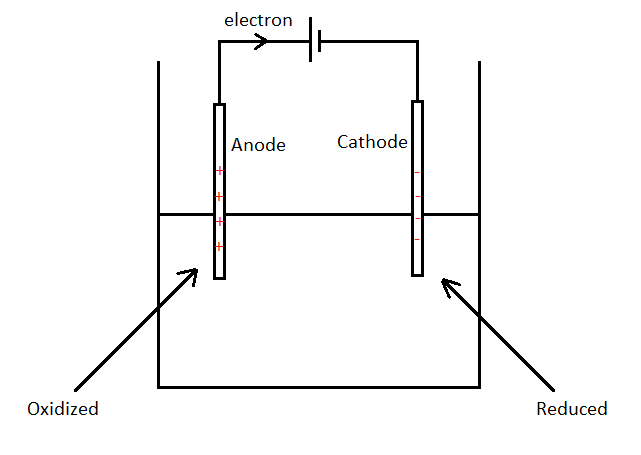
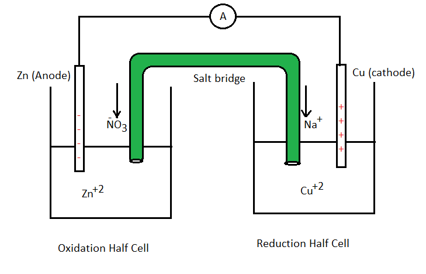

# [{ align=left, width=3.8% }](../../index.md)  Electrochemistry | Electrochemical Cells

## Electrochemical Cells

* Devices which can convert electrical energy into chemical energy or chemical energy into electrical energy are called electrochemical cells.
* There are two types of electrochemical cells: (a) Electrolytic cell (b) Galvanic cell.

## Electrolytic Cell

{loading=lazy}

* An electrolytic cell converts electrical energy into chemical energy.
* In an electrolytic cell, the reaction is non-spontaneous. So, $&Delta;G > 0$. The reaction is made spontaneous by supplying current.
* Anode is positively charged and cathode is negatively charged.

## Galvanic Cell

* It is also known as Daniell Cell.

* A galvanic cell converts chemical energy into electrical energy.

* Current is flown by a spontaneous process. So, $&Delta;G < 0$.

* Anode is negative and cathode is positive in a galvanic cell.

* Oxidation Half Cell Reaction (At anode):

!!! tip ""

    $$Zn_{(s)} &rarr; Zn^{+2}_{(aq)} + 2e^-$$

* Reduction Half Cell Reaction (At cathode):

!!! tip ""

    $$Cu^{+2}_{(aq)} + 2e^- &rarr; Cu_{(s)}$$

* Current flows from cathode to anode in an **external** circuit.

### Salt Bridge

* It is a U-Shaped tube which is filled with a mixture of agar-agar and an inert electrolyte like KNO3, NaNO3, KCl etc and both the ends of this tube are sealed with cotton wool.

#### Functions of Salt Bridge:

* It completes the inner circuit.
* It prevents the diffusion of electrolytic solution in the two half cells.
* It maintains electrical neutrality in the two cells. If excess electrons get accumulated, then salt bridge releases cations like Na+ to maintain electrical neutrality. If excess electrons are consumed, then salt
  bridge releases anions like Cl- and NO3- to maintain electrical neutrality.

#### Characteristics of Inert Electrolyte:

* Both of its ions should not participate in the cell reactions.
* Velocities of both ions of the electrolyte should be same. In the above figure, velocity of Na+ is approximately equal to velocity of NO3-.
