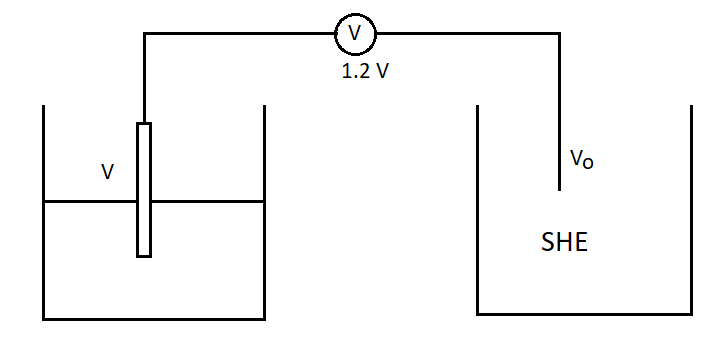
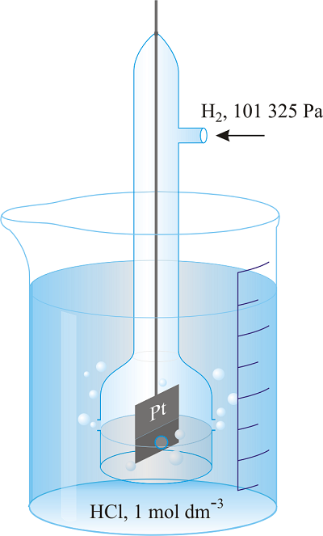

# [{ align=left, width=3.8% }](../../index.md)  Electrochemistry | Electrode Potential

## Electrode Potential

* The potential difference between electrode and electrolytic solution is known as electrode potential.
* The natural tendency of an electrode to gain or lose electron is measured in terms of volts, called electrode potential.
* It is of two types: (a) Oxidation Potential (b) Reduction Potential
* Oxidation potential is represented as Eox or EM/Mn+ and reduction potential is represented as Ered or EMn+/M.

!!! tip ""

    $$E_{ox} = -E_{red}$$

## Standard Electrode Potential(E0)

* The potential difference between the electrode and electrolytic solution at 25oC and 1 bar pressure when concentration of electrolytic solution is 1 molar is known as standard electrode potential.
* It is of two types: (a) Standard Oxidation Potential(E0ox) (b) Standard Reduction Potential(E0red)
* The element having more positive value of reduction potential will easily undergo reduction. It will also act as a good oxidizing agent.
* The element having more positive value of oxidation potential will easily undergo oxidation. It will also act as a good reducing agent.

!!! question "The E0red of I2, Br2, Cl2 and F2 are 0.35 V, 0.45 V, 1.3 V and 2.7 V. Arrange them in decreasing order of strength of oxidizing agent."

    The element having more positive value of reduction potential will easily undergo reduction. It will also act as a good oxidizing agent. So, the order will be: F2 > Cl2 > Br2 > I2

## Determination of Electrode Potential

* Electrode Potential of a single electrode cannot be calculated. So, we need a standard electrode as a reference for measuring electrode potential.
* This standard electrode is known as standard hydrogen electrode.
* The electrode potential of Standard Hydrogen Electrode is taken as zero.

!!! example "Example"

    {loading=lazy}

    If voltmeter shows 1.2 V, then:

    $$V - V_o = 1.2$$

    Vo will be zero because it is standard hydrogen electrode.

    $$V - 0 = 1.2$$

    $$V = 1.2\ V$$

## Standard Hydrogen Electrode(SHE)

{loading=lazy}

* Standard Hydrogen Electrode is taken as a standard for measuring electrode potentials.

* It is a half cell and can be both as a cathode and an anode.

* If it acts as a cathode:

!!! tip ""

    $$H^+_{(aq)} + e^- &rarr; {1\over 2}H_2{(g)},\ E^o_{red} = 0$$

* If it acts as an anode:

!!! tip ""

    $$ {1\over 2}H_2{(g)} &rarr; H^+_{(aq)} + e^-,\ E^o_{ox} = 0$$

## Electrochemical Series

* When different elements are arranged in order of their Standard Reduction Potential or Standard Oxidation Potential, a series is obtained which is known as electrochemical series.

* On the basis of decreasing standard oxidation potential, the series is:

!!! tip ""

    Li > K > Ba > Sr > Ca > Na > Mg > Al > Mn > Zn > Cr > Fe > Cd > Co > Ni > Sn > Pb > H2 > Cu > I2 > Ag > Hg > Br2 > Pt > O2 > Cl2 > Au > F2.

* The elements written before H2 like Li, K, Ca have positive standard oxidation potentials while the elements written after H2 like Cu, Pt, Hg have negative standard oxidation potentials.
