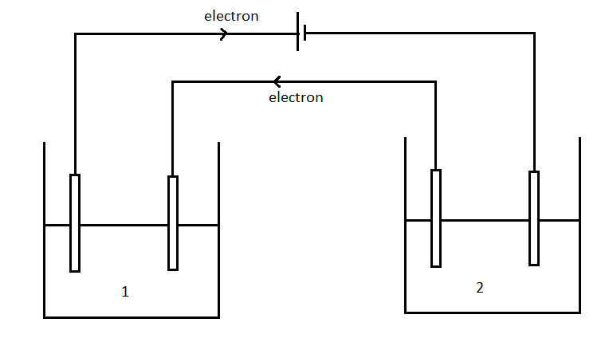

# [{ align=left, width=3.8% }](../../index.md)  Electrochemistry | Faraday's Laws of Electrolysis

Electrolysis can be defined as a process to drive a non-spontaneous reaction by using a direct current. It can be used to decompose ionic compounds into their ions. Electrolysis is also used to separate elements from their ores.

## Faraday's First Law

* Faraday's First law of electrolysis states that the mass of chemical deposited due to flow of current through an electrolyte is directly proportional to the quantity of electricity or charge (Q) passed through it.
* If m is the mass deposited and Q is the charge passed, then we can write:

!!! tip ""

    $$m &Proportional; Q$$

    $$m = ZQ$$

    $$Or,\ m = Zit$$

* Here, Z is known as Electrochemical Equivalence. It is defined as the mass deposited due to one coulomb charge.
* Let us calculate the value of Z for a chemical reaction:

!!! tip ""

    $$X^{n+} + ne^- &rarr; X$$

    In this reaction, if 1 Farad charge (96500 C) is passed, then ${1 \over n}$ moles X is deposited.

    In other words, we can say that if 96500 C charge is passed, then ${M \over n}$ grams X is deposited, where M = Molar mass of X.

    If 1 C charge is passed, the ${M \over 96500n}$ grams mass is deposited. Thus, $Z = {M \over 96500n}$

    $$Z = {M \over 96500n}$$

    Putting this value of Z in m = Zit:

    $$m = {Mit \over 96500n}$$

    $$Or,\ m = {Eit \over 96500}$$

    Here, E = M/n is known as Equivalent mass.

## Faraday's Second Law

* Faraday's Second law of electrolysis states that when the same quantity of electricity is passed through several electrolytes, the mass of the substances deposited are proportional to their respective chemical equivalent
  or equivalent mass.
* We have already derived the following equation:

!!! tip ""

    $$m = {Eit \over 96500}$$

    $$m &Proportional; E$$

{loading=lazy}

* For two electrolytes 1 and 2, we can write:

!!! tip ""

    $$ {m_1 \over m_2} = {E_1 \over E_2}$$

## Question

!!! question "In an experiment of two cells in series, current was passed for five hours. The amount of gold deposited was 9.85 grams. Calculate the amount of copper deposited and magnitude of current. (Au = 197 u and Cu = 63.5 u)"

    Reactions of the process are given below:

    $$Au^{+3} + 3e^- &rarr; Au$$

    $$Cu^{+2} + 2e^- &rarr; Cu$$

    $$Equivalent\ mass\ of\ Au\ (E_1) = {M \over n} = {197 \over 3}$$

    $$Equivalent\ mass\ of\ Cu\ (E_2) = {M \over n} = {63.5 \over 2}$$

    $$Mass\ of\ Au\ deposited\ (m_1) = 9.85\ g$$

    $$Let\ Mass\ of\ Au\ deposited\ = m_2$$

    $$ {m_1 \over m_2} = {E_1 \over E_2}$$

    $$m_2 = {m_1E_2 \over E_1}$$

    $$m_2 = {9.85 \times {63.5 \over 2} \over {197 \over 3}}$$

    $$m_2 = 4.7625\ g$$

    Let us calculate the current used in the process:

    $$m_1 = {E_1 it \over 96500}$$

    $$i = {m_1\times 96500 \over E_1t}$$

    $$i = {9.85 \times 96500 \over {197 \over 3} \times {5\times 60 \times 60}} = 0.804\ Ampere$$
