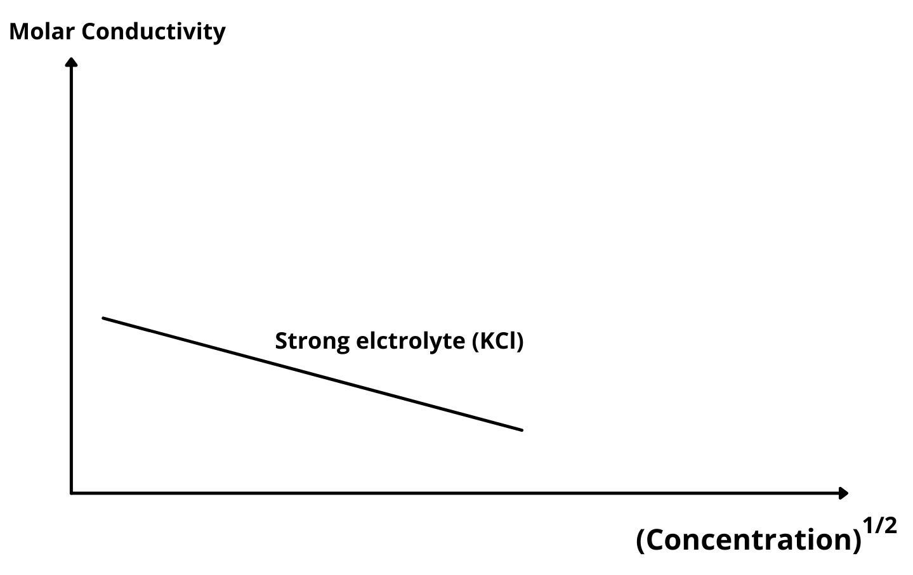
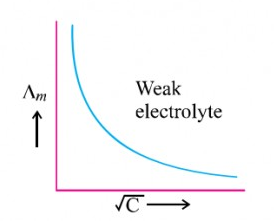

# [{ align=left, width=3.8% }](../../index.md)  Electrochemistry | Variation of Conductivity and Molar Conductivity with Concentration

## Conductivity

* The conductivity of a solution at any given concentration is the conductance of one unit volume of solution kept between platinum electrodes with unit area of cross-section and at a distance of unit length.

!!! tip ""

    $$G = { &Kappa;A \over l} = &Kappa;$$

* Conductivity always decreases with decrease in concentration both for weak and strong electrolyte because the number of ions per unit volume that carry the current in a solution decreases on dilution.

## Molar Conductivity

* Molar conductivity of a solution at a given concentration is the conductance of the volume V of solution containing one mole of electrolyte kept between two electrodes with area of cross section A and distance of unit
  length.

* Molar conductivity is also defined as the conductivity of solution per unit its concentration.

!!! tip ""

    $$ &lambda;_m = {&Kappa; \over C}$$

    $$ &lambda;_m = {&Kappa; \over {n \over V}}$$

    $$ &Therefore; &lambda;_m = {&Kappa; V \over n} $$

* Molar conductivity increases with decrease in concentration because $&lambda;_m &Proportional; {1 \over C}$.

* It has been found that decrease in conductivity on dilution of a solution is more than compensated by increase in its volume. Physically, it means that at a given concentration, &lambda;m can be defined as the
  conductance of the electrolytic solution kept between the electrodes of a conductivity cell at a unit distance but having area of cross-section large enough to accommodate sufficient volume of solution that contains one mole
  of the electrolyte.

* **Limiting Molar Conductivity:** When the concentration approaches zero, the molar conductivity is known as limiting molar conductivity and is represented by $&lambda;^0_m$.

* The variation of molar conductivity, &lambda;m with concentration is different for strong and weak electrolytes.

## Variation of Molar Conductivity with Concentration in Strong Electrolytes

{loading=lazy}

* For strong electrolytes, &lambda;m increases slowly with dilution and can be represented by the equation:

!!! tip ""

    $$ &lambda;_m = &lambda;^0_m - AC^{1/2} $$

    Here, intercept = $&lambda;^0_m$ and slope = A

* The value of 'A' for a given solvent and temperature depends on the type of electrolyte, ie, charges on the cation and anion produced on the dissociation of the electrolyte in the solution.

* NaCl, CaCl2, MgSO4 are 1-1, 2-1 and 2-2 electrolytes respectively. All electrolytes of particular type have the same value for 'A'.

## Kohlrausch Law of independent migration of ions

* It states that limiting molar conductivity of an electrolyte can be represented as the sum of the individual contributions of the anion and cation of the electrolyte.

* In general, if an electrolyte on dissociation gives $ &nu;_+ $ cations and $ &nu;_- $ anions, then its limiting molar conductivity is given by:

!!! tip ""

    $$ &lambda;^0_m = &nu;_+ &lambda;^0_+ + &nu;_- &lambda;^0_- $$

* Here, $&lambda;^0_+$ = Limiting molar conductivity of cation and $&lambda;^0_-$ = Limiting molar conductivity of anion

## Variation of Molar Conductivity with Concentration in Weak Electrolytes

{loading=lazy}

* For weak electrolytes, molar conductivity (&lambda;m) increases steeply on dilution, especially near lower concentrations. Therefore, limiting molar conductivity (&lambda;0m) cannot be
  obtained by extrapolation of &lambda;m to zero concentration.

* At infinite dilution (i.e, concentration &rarr; 0), electrolyte dissociates completely (&alpha;=1) but at such low concentration, the conductivity of the solution cannot be measured accurately.

* Therefore, &lambda;0m for weak electrolytes is obtained by using Kohlrausch law of independent migration of ions.

* At any concentration C, if &alpha; is the degree of dissociation, then it can be approximated to the ratio of molar conductivity &lambda;m at the concentration C to limiting molar conductivity
  &lambda;0m.

!!! tip ""

    $$ &alpha; = {&lambda;_m \over &lambda;^0_m} $$

* For weak electrolytes like acetic acid:

!!! tip ""

    $$CH_3COOH &#8652; CH_3COO^- + H^+$$

    At time t = 0, let concentration of CH3COOH = c and concentration of CH3COO- and H+ = 0.

    If &alpha; is the degree of dissociation, at time t = t, concentration of CH3COOH = c-c&alpha; and concentration of CH3COO- and H+ = c&alpha;

    Dissociation constant, Ka is given by:

    $$K_a = {[CH_3COO^-] [H^+] \over [CH_3COOH]}$$

    $$K_a = {c&alpha; \times c&alpha; \over c-c&alpha;}$$

    $$K_a = {c&alpha;^2 \over (1-&alpha;)}$$

    $$where, &alpha; = {&lambda;_m \over &lambda;^0_m}$$
