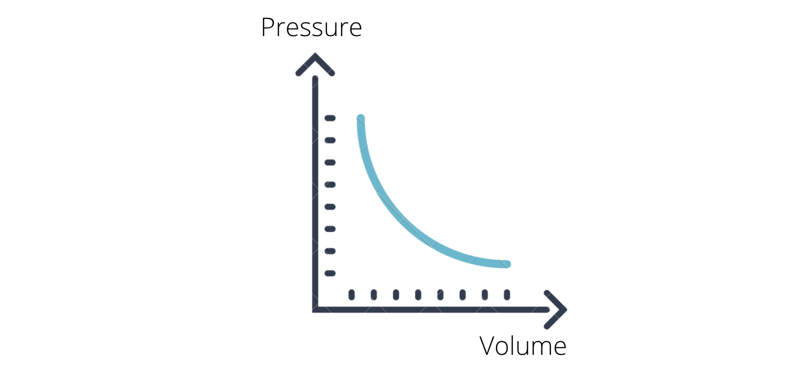
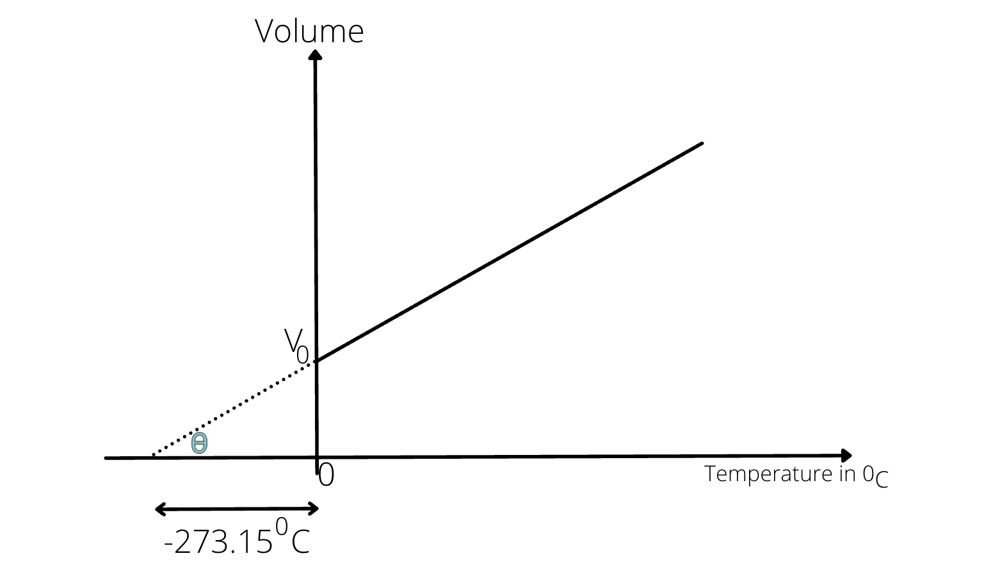
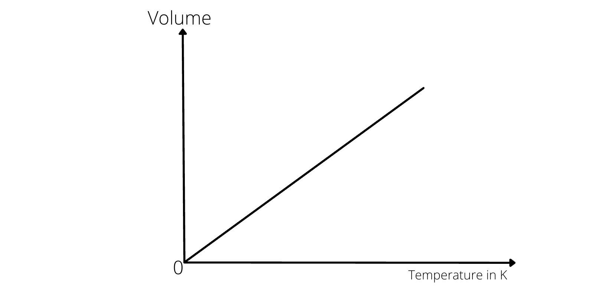
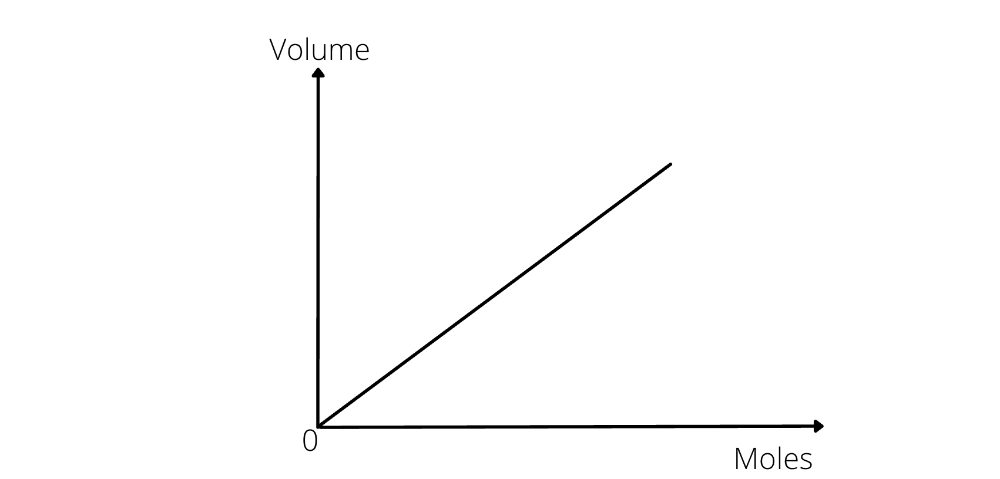

# [{ align=left, width=3.8% }](../../index.md)  Gaseous State | Gas Laws

## Boyle's Law

* At constant temperature, the pressure of a fixed mass of a gas is inversely proportional to its volume.

!!! tip ""

    $$P &Proportional; {1 \over V}$$

    $$PV = constant$$

{loading=lazy}

## Charle's Law

* At constant pressure, the volume of a fixed mass of a gas is directly proportional to its temperature.

!!! tip ""

    $$V &Proportional; T$$

    $$ {V \over T} = constant$$

    where, T = Absolute Temperature (Kelvin scale)

{loading=lazy}

!!! tip ""

    $$Slope, m = tan &Theta; = {V_0 \over 273.15} &approx; {V_0 \over 273}$$

    $$&Therefore; V = {V_0 \over 273}T + V_0$$

    where, T is in celsius.

* A new temperature scale was introduced known as Kelvin scale.

{loading=lazy}

## Gay Lussac's Law

* At constant volume, for a fixed mass of a gas, pressure is directly proportional to its temperature.

!!! tip ""

    $$P &Proportional; T$$

    $$ {T \over P} = constant $$

    where, T = Absolute Temperature (Kelvin scale)

{loading=lazy}

!!! tip "Note"

    Mean free path, $&lambda; &Proportional; {T \over P}$. If Gay Lussac's Law is valid or applicable, then mean free path is constant. We will discuss about mean free path in detail later.

## Avogadro's Hypothesis

* At constant temperature and pressure, volume occupied by a gas, V is directly proportional to its number of moles, n.

* More accurately, if ${T \over P} = constant$, then:

!!! tip ""

    $$V &Proportional; n$$

{loading=lazy}
