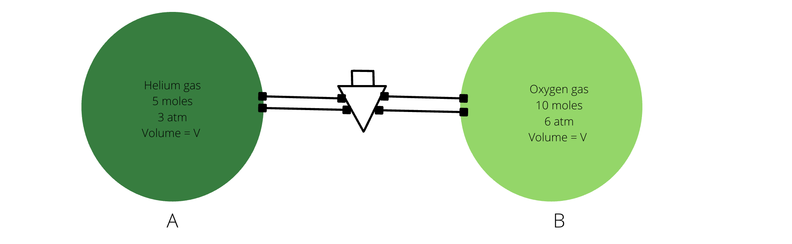

# [{ align=left, width=3.8% }](../../index.md)  Gaseous State | Ideal Gas Equation

## Ideal Gas Equation

* By Boyle's Law, we know that for a given mass of a gas, pressure is inversely proportional to volume at constant temperature.

!!! tip ""

    $$P &Proportional; {1 \over V}$$

* By Charle's Law, we know that for a given mass of a gas, volume occupied by the gas is directly proportional to temperature at constant pressure.

!!! tip ""

    $$V &Proportional; T$$

* By Gay Lussac's Law, we know that for a given mass of a gas, pressure is directly proportional to temperature at constant volume.

!!! tip ""

    $$P &Proportional; T$$

* By Avogadro's Law, we know that volume occupied by a gas is directly proportional to its moles at constant temperature and pressure.

!!! tip ""

    $$V &Proportional; n$$

* Combining all above four equations, we obtain the ideal gas equation:

!!! tip ""

    $$PV &Proportional; nT$$

    $$PV = nRT$$

    Here, R = Universal Gas Constant

!!! tip "Values of R in different units"

    $$R = 0.0821\ atm\ L\ mol^{-1}$$

    $$R = 8.314\ J\ mol^{-1}\ K^{-1}$$

    $$R = 1.98 &approx; 2\ calorie\ mol^{-1}\ K^{-1}$$

    * Note that $1\ calorie = 4.184\ J$

## Questions

??? question "An ideal gas at 300 K is kept in an open container of volume 5 L. When temperature is raised to 500 K keeping pressure constant, calculate the percentage of moles of gas molecules escaped."

    $$PV = nRT$$

    Here, PV = constant because P and V both are constants.

    $$Constant = nRT$$

    $$n &Proportional; {1 \over T}$$

    Let initial and final moles be ni and nf respectively and let initial and final temperatures be Ti and Tf.

    $$ {n_i \over n_f} = {T_f \over T_i} $$

    $$ {n_i \over n_f} = {500 \over 300} $$

    $$ {n_i \over n_f} = {5 \over 3} $$

    $$ {n_f \over n_i} = {3 \over 5} $$

    Percentage of moles of gas escaped:

    $$Percentage\ of\ moles\ of\ gas\ escaped = {n_i - n_f \over n_i} \times 100$$

    $$Percentage\ of\ moles\ of\ gas\ escaped = {1 - {n_f \over n_i}} \times 100$$

    $$Percentage\ of\ moles\ of\ gas\ escaped = {1 - {3 \over 5}} \times 100 = 40$$

??? question "A water bubble on the surface has volume = 4V. When it reaches at a depth of 'h', its volume becomes V. If 10 m water = 1 atm, calculate the value of 'h'.  {loading=lazy}"

    Let initial pressure be $P_1$, final pressure be $P_2$, initial volume be $V_1$ and final volume be $V_2$.

    $$ {P_1 \over P_2} = {V_2 \over V_1}$$

    $$ {1\ atm + h \over 1\ atm} = {4V \over V}$$

    $$ {10 + h \over 10} = 4$$

    $$ h = 30\ m$$

??? question "Find the common pressure when the stop cork is removed. The scenario is shown below:  {loading=lazy}"

    Let the common pressure attained when the stop cork is removed be P.

    $$Initial\ moles = Final\ moles$$

    $$ {P_A V \over RT} + {P_B V \over RT} = {P(V + V) \over RT} $$

    $$ P_A + P_B = 2P $$

    $$ 3 + 6 = 2P $$

    $$ P = 4.5\ atm $$
