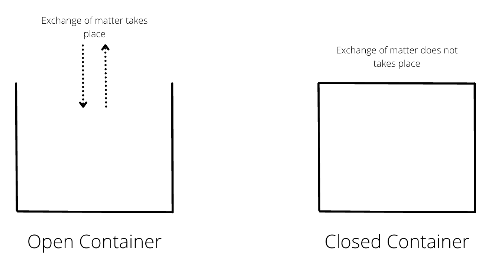
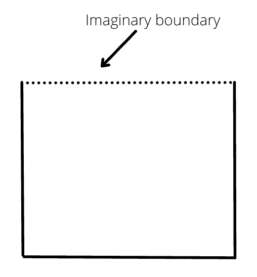
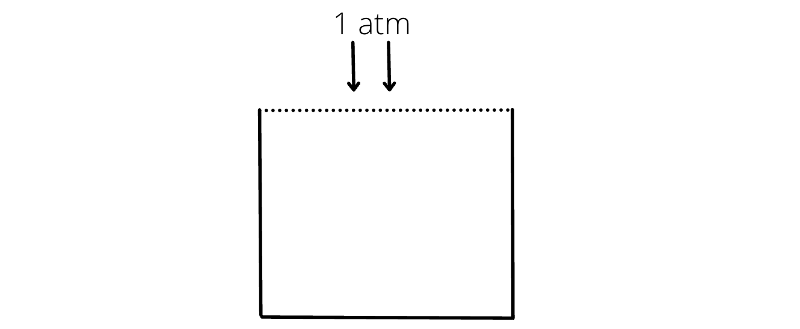
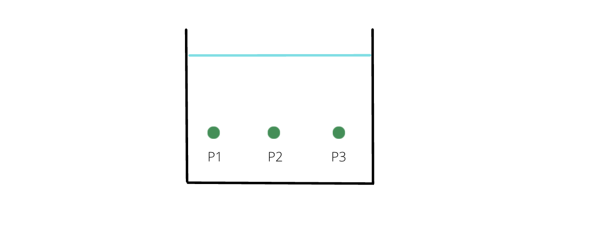
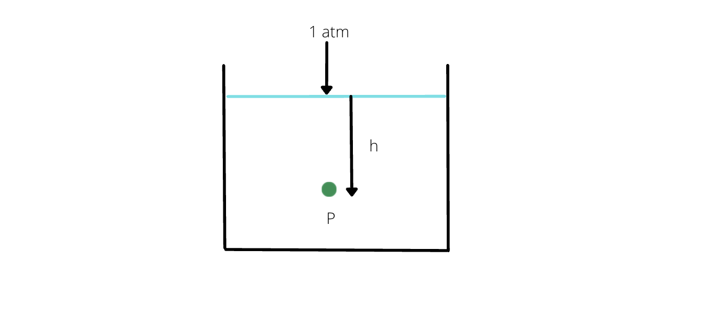
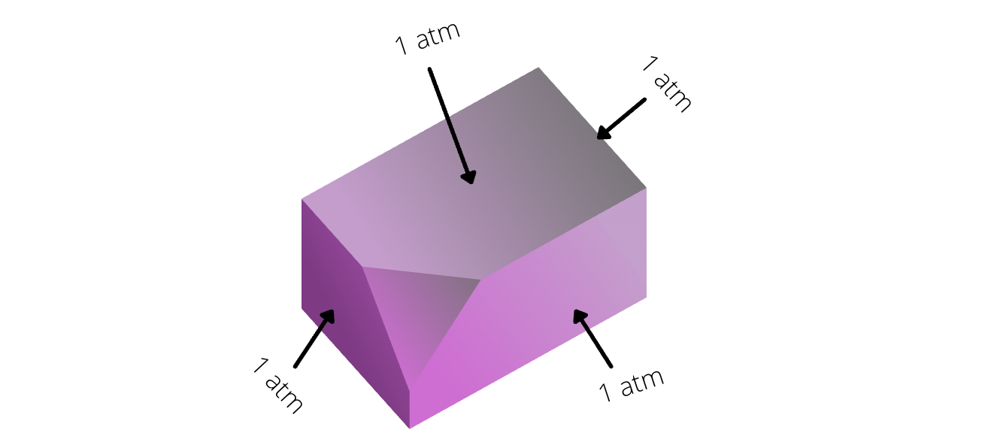
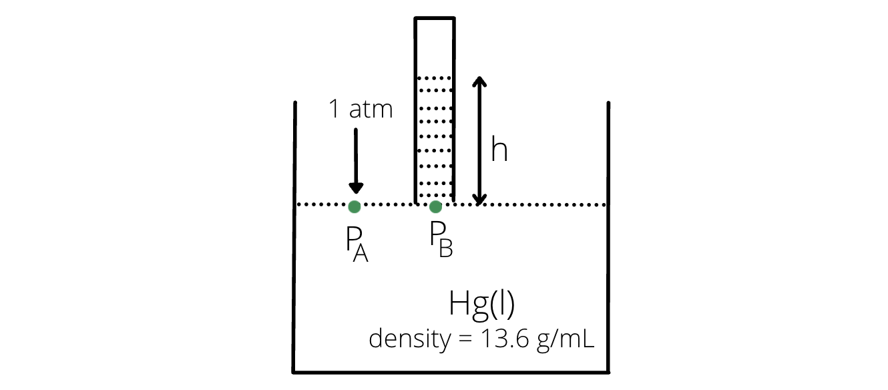

# [{ align=left, width=3.8% }](../../index.md)  Gaseous State | Introduction

In the chapter of gaseous state, we will mainly focus on three things: (a) Ideal Gas Equation (b) Kinetic Theory of Gases and (c) Real Gases.

## Volume of a container

* The maximum amount of quantity contained by the container is known as its volume.

* There are two types of containers - open container and closed container.

{loading=lazy}

* Open containers allow exchange of both matter and energy while closed containers do not allow exchange of matter but can allow exchange of energy through walls.

* While calculating volume of the open container, we consider an imaginary boundary at the open end.

{loading=lazy}

* There are several units of volume: cubic centimetre(cm3), cubic metre(m3), millilitres(mL), litres(L). The standard unit of volume is litre(L).

!!! tip ""

    $$1\ cm^3 = 1\ mL$$

    $$1000\ cm^3 = 1\ L$$

    $$1000\ mL = 1\ L$$

## Pressure

* Force (F) applied per unit area (A) is known as pressure (P). Mathematically, it can be stated as:

!!! tip ""

    $$P = {F \over A}$$

* The SI unit of pressure is Newton per square metre (N/m2) or Pascal (Pa).

* There are other units of pressure such as atm, bar, torr etc.

!!! tip "Remember"

    $$1\ bar = 10^5\ Pa = 10^5\ N/m^2$$

    $$1\ atm = 101325\ Pa &approx; 10^5\ Pa$$

    $$1\ atm &approx; 1\ bar$$

    $$760\ mm\ of\ Hg = 1\ atm$$

    $$1\ atm = 760\ torr$$

* At the open end of a container under normal conditions, pressure is always 1 atm.

{loading=lazy}

* **Pressure at a depth 'h' of a liquid:**

!!! tip ""

    Let the density of a liquid be &rho;, mass be M and volume be V.

    $$&rho; = {M \over V}$$

    $$M = &rho;V$$

    $$M = &rho;hA$$

    Now, we know that pressure can be calculated as:

    $$P = {F \over A}$$

    $$P = {Mg \over A}$$

    $$P = {&rho;hAg \over A}$$

    $$P = &rho;gh$$

* Pressure is same at the same horizontal level.

{loading=lazy}

!!! tip ""

    $$P_1 = P_2 = P_3$$

* For an open container, at depth 'h' of a fluid, net pressure is:

{loading=lazy}

!!! tip ""

    $$P = (1 atm) + &rho;gh$$

* Pressure is same at all faces of a container. In other words, there exists a same external pressure for a container.

{loading=lazy}

## Measurement of Pressure

* Let us consider a container filled with liquid mercury at 1 atm external pressure and let a test tube be placed inverted above the surface of the liquid.

{loading=lazy}

!!! tip ""

    $$P_A = P_B$$

    $$1\ atm = &rho;gh$$

    $$10^5\ Pa = (13.6\ g/mL) \times 9.8 \times h$$

    $$10^5\ Pa = (13.6 \times 1000 kg/m^3) \times h$$

    $$h = 0.76\ m\ of\ Hg$$

    $$h = 76\ cm\ of\ Hg$$

    $$h = 760\ mm\ of\ Hg$$

!!! tip "Note"

    Water cannot be used for measuring pressure because the height of water will be very large, so it will be difficult to get such a ling test tube.

    If water is used, height of test tube, hw is calculated as:

    $$&rho;_wgh_w = &rho;_{Hg}gh_{Hg}$$

    $$1 \times h_w = 13.6 \times 0.76$$

    $$h_w = 10.336\ m$$
