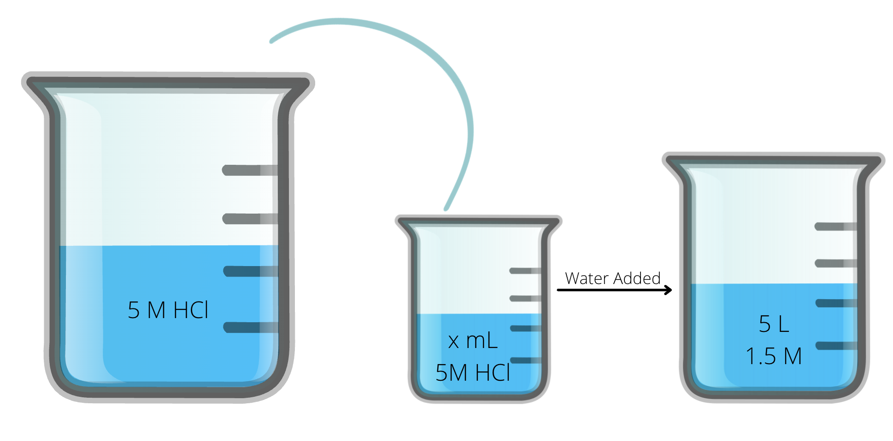

# [{ align=left, width=3.8% }](../../index.md)  Mole Concept | Concentration Terms

* Concentration terms are used to signify the amount of solute dissolved in a solvent. 
* Concentration does not change on taking out a part of the solution. For example, if the concentration of 10 L of solution is 'c', then the concentration of same 100 mL solution will also be 'c'. 
* Solute + Solvent = Solution. In a solution, solute is in lesser quantity and solvent is in higher quantity. 

## 1. Molarity

* Molarity is defined as the number of moles of solute dissolved per litre of the solution. 
* It is denoted by 'M' and its unit is moles/L. 
* If the molarity of a solution is 3 moles/L, then we say that the solution is 3 molar (3 M).

!!! tip ""

    $$Molarity = {Moles\ of\ solute \over Volume\ of\ solution\ in\ L}$$

* Since volume changes with the change in temperature, therefore, molarity is temperature dependent.

## 2. Grams Per Litre

* It is defined as the grams of solute dissolved per litre of the solution.
* It is denoted by 'g/L' and its unit is g/L.

!!! tip ""
              
    $$g/L = {Mass\ of\ solute\ in\ grams \over Volume\ of\ solution\ in\ L}$$

* Since volume changes with the change in temperature, therefore, g/L is temperature dependent.

## 3. Molality
            
* Molality is defined as the number of moles of solute dissolved per kilogram of the solvent.
* It is denoted by 'm' and its unit is moles/Kg.
* If the molality of a solution is 3 moles/Kg, then we say that the solution is 3 molal (3 m).

!!! tip ""
    
    $$Molality = {Moles\ of\ solute \over Mass\ of\ solvent\ in\ Kg}$$

* Since moles and mass both are independent of temperature, therefore, molality is temperature independent.

## 4.Mole Fraction
            
* Let us consider a solution/mixture consisting of two components: A and B. Mole fractions of A and B are defined as:

!!! tip ""

    $$&Chi;_A = {n_A \over n_A + n_B}$$
    
    $$&Chi;_B = {n_B \over n_A + n_B}$$
              
    Here, nA = moles of A, nB = moles of B

* It is worth noting that:

!!! tip ""

    $$&Chi;_A + &Chi;_B = 1$$
              
* Similarly, let us consider a mixture consisting of 'n' components: 1, 2, 3, ...i, ... n. Mole fraction of ith component can be defined as:

!!! tip ""

    $$&Chi;_i = {n_i \over n_1 + n_2 + n_3 + .... + n_n}$$

    $$&Chi;_1 + &Chi;_2 + &Chi;_3 + ... +\ &Chi;_i\ + ... + &Chi;_n = 1$$
              
* Mole fraction is a unitless quantity.
* Mole fraction is temperature independent because mole does not depend on temperature.

## 5. Parts per million and Parts per billion
            
* Parts per million (ppm) is defined as:

!!! tip ""

    $$ppm = {Mass\ of\ solute \times 10^6 \over Mass\ of\ solution}$$

* Parts per billion (ppb) is defined as:

!!! tip ""

    $$ppb = {Mass\ of\ solute \times 10^9 \over Mass\ of\ solution}$$
              
* Both ppm and ppb are unitless quantities.
* Both ppm and ppb are temperature independent because mass does not depend on temperature.

## Questions

??? question "A 1M H2SO4 solution is taken whose density is 1.1 g/mL. Calculate its molality."

    $$Molarity\ of\ H_2SO_4\ solution = 1\ M$$
    
    $$Let\ the\ volume\ of\ solution\ be\ 1\ L.$$
    
    $$Then,\ the\ moles\ of\ solute(H_2SO_4) = 1\ mole$$
    
    $$&Therefore; Mass\ of\ solute(H_2SO_4) = 1\times 98 = 98 grams$$
    
    $$Density\ of\ solution = 1.1\ g/mL.$$
    
    $$Mass\ of\ solution = 1.1 \times 1000 = 1100\ g$$
    
    $$Mass\ of\ solvent = Mass\ of\ solution - Mass\ of\ solute$$
    
    $$Mass\ of\ solvent = 1100 - 98 = 1002\ g = 1.002\ Kg$$
    
    $$Molality = {Moles\ of\ solute \over Mass\ of\ solvent\ in\ Kg}$$
    
    $$Molality = {1 \over 1.002} = {500 \over 501}$$

??? question "Two solutions of 100 mL and 200 mL are taken. 100 mL solution containing NaCl has the molarity of 0.2 M while 200 mL solution containing CaCl2 has molarity of 0.5 M. The two solutions are mixed in a beaker and an additional 100 mL water is added to it. Calculate molarity of Cl- ions."

    * For solution 1:
                  
    $$Moles\ of\ NaCl = M \times V$$
                  
    $$Moles\ of\ NaCl = 0.2 \times 100 \times 10^{-3} = 0.02$$
    
    $$Moles\ of\ Cl^- = 0.02$$
                  
    * For solution 2:
                  
    $$Moles\ of\ CaCl_2 = M \times V$$
                  
    $$Moles\ of\ CaCl_2 = 0.5 \times 200 \times 10^{-3} = 0.1$$
                  
    $$Moles\ of\ Cl^- = 2 \times 0.1 = 0.2$$
                  
    * Total moles of Cl- ions:
                  
    $$Total\ moles\ of\ Cl^- = 0.02 + 0.2 = 0.22$$
                  
    * Total volume of solution:
                  
    $$Total\ volume\ of\ solution = 100 + 200 + 100 = 400\ mL = 0.4\ L$$
                  
    * Molarity of Cl- ions:
                  
    $$Molarity\ of\ Cl^- = {0.22 \over 0.4} = 0.54\ M$$

??? question "5 M HCl solution is given from which x mL is taken out in a container. Water is added to it such that volume of solution becomes 5 L and molarity becomes 1.5 mL. Find x."

    
    
    $$Initial\ moles\ of\ HCl\ taken\ out = Final\ moles\ of HCl\ when\ water\ is\ added$$
              
    $$5 \times x \times 10^{-3} = 1.5 \times 5$$
              
    $$x = 1500 mL$$