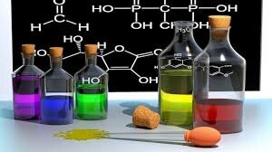

# [{ align=left, width=3.8% }](../../index.md)  Solution | Introduction

## Solution

* Solutions are homogeneous mixtures of two or more components, i.e, the composition and properties of all the components are uniform throughout the mixture.
* Single phase containing two or more components is called solution.
* Solution consists of a solvent and one or more solutes.
* Generally, the component which has same phase as that of a solution and is present in larger amount is known as solvent.
* Generally, the component which is present in smaller amount is known as solute.
* Examples: Solution of H2O + NaCl, Air (Mixture of different gases), Blood (mixture of water, oxygen, haemoglobin etc.).

{loading=lazy}

## Types of Solutions and Examples

Type of solution |	Solute    |	Solvent  |	Examples                            |
-----------------|------------|----------|--------------------------------------|
Gaseous Solution | Gas	      | Gas	     | Air (Mixture of oxygen and nitrogen) |
Gaseous Solution | Liquid	    | Gas	     | Chloroform mixed with nitrogen gas   |
Gaseous Solution | Solid	    | Gas      | Camphor in nitrogen gas              |
Liquid Solution	 | Gas	      | Liquid	 | Oxygen dissolved in water            |
Liquid Solution	 | Liquid	    | Liquid	 | Ethanol dissolved in water           |
Liquid Solution	 | Solid	    | Liquid	 | Glucose dissolved in water           |
Solid solution	 | Gas	      | Solid	   | Solution of hydrogen in palladium    |
Solid solution	 | Liquid     |	Solid	   | Amalgam of mercury with sodium       |
Solid solution	 | Solid	    | Solid	   | Copper dissolved in gold (Alloys)    |
