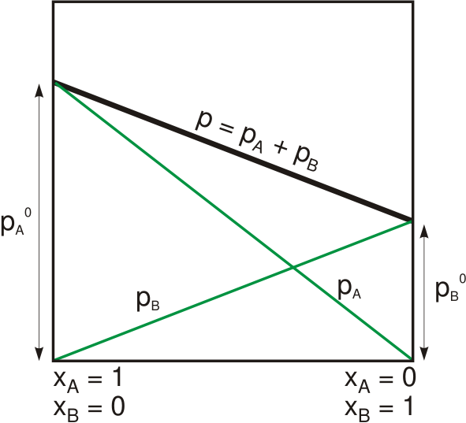

# [{ align=left, width=3.8% }](../../index.md)  Solution | Raoult's Law

## Raoult's Law to calculate Vapour Pressure

* Raoult's Law states that the partial pressure or vapour pressure of any volatile constituent of solution at a given temperature is equal to the product of vapour pressure of pure constituent and its mole fraction in the solution.

!!! tip ""

    $$p = {p^o\ &Chi;}$$

* For a solution containing two volatile liquids A and B, we can write:

!!! tip ""

    $$p_A = {p^o_A\ &Chi;_A}$$

    $$p_B = {p^o_B\ &Chi;_B}$$

    where,

    pA = partial pressure of A

    pB = partial pressure of B

    poA = partial pressure of pure liquid A

    poB = partial pressure of pure liquid B

    &Chi;A = mole fraction of A in solution

    &Chi;B = mole fraction of B in solution

* From Dalton's law, we can calculate total pressure, P:

!!! tip ""

    $$P = {p_A + p_B}$$

    $$P = {p^o_A\ &Chi;_A + p^o_B\ &Chi;_B}$$

    $$P = {p^o_A\ &Chi;_A + p^o_B\ (1-&Chi;_A)}$$

    $$P = {(p^o_A-p^o_B)&Chi;_A + p^o_B}$$

* The graph of Raoult's law will be a straight line because it is of the form y = mx+c.

{loading=lazy}

Image credit: [https://en.wikipedia.org/wiki/Raoult's_law](https://en.wikipedia.org/wiki/Raoult%27s_law){:target="_blank"}

## Raoult's Law as a special case of Henry's Law

* According to Henry's law, partial pressure of a gas over the surface of a solution is directly proportional to its mole fraction dissolved in the solution and is given by:

!!! tip ""

    $$p = {K_H\ &Chi;}$$

* According to Raoult's law, partial pressure of a volatile liquid in gaseous form over the surface of a solution is also directly proportional to its mole fraction dissolved in the solution and is given by:

!!! tip ""

    $$p = {p^o\ &Chi;}$$

* From the above two equations, it can be clearly seen that there is a difference in proportionality constant between two equations. If a volatile liquid is dissolved in solution, then KH becomes po.

* Thus, Raoult's law is the special case of Henry's law where KH = po.
