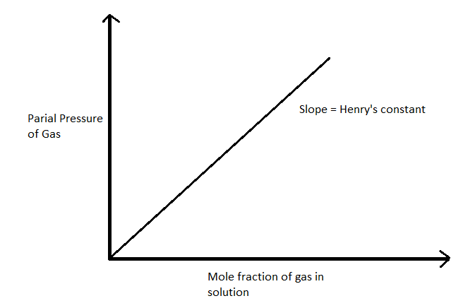

# [{ align=left, width=3.8% }](../../index.md)  Solution | Solubility of Gas in Liquid

## Solubility of Gas in Liquid

* All gases are soluble in all liquids to some extent depending on pressure.
* For example, presence of carbon dioxide in cold drinks, presence of oxygen in blood, presence of oxygen in water.
* Hydrogen chloride(HCl) gas is highly soluble in water.

## Factors affecting the solubility of gases in liquids

#### 1. Nature of gas:

* Easily liquifiable gases(CO2, SO2, NH3) are more
  soluble in common solvents like water as compared to other gases(H2,
  N2).
* The gases which can form hydrogen bonds or some other types of attractions with the
  solvent have higher solubility. Example: NH3 in H2O

#### 2. Temperature:

* The solubility of gases in liquid decreases with increase in temperature because on
  increasing temperature, gas expands and its kinetic energy increases. Also for
  hydrogen bonded gases like NH3, H-bonds dissociate on increasing
  temperature.
* Cold drinks are kept at low temperature to prevent the escape of CO2 gas.

#### 3. Pressure:

* The effect of pressure on solubility of gases can be explained by Henry's law.
* Henry's law states that the **partial pressure of a gas on the surface of
  solution** is directly proportional to its **mole fraction dissolved in
  the solution**.

!!! tip ""

    $$p &Proportional; &Chi;_{gas}$$

    $$p = {K_H &Chi;_{gas}}$$

    where, p = partial pressure of gas above the surface of solution

    &Chi;gas = Mole fraction of gas in the solution

    KH = Henry's Constant (It is the characteristic of a gas)

* Graph for Henry's law will be a straight line with slope = KH as shown below:

{loading=lazy}

* Higher is the value of KH, lower is the solubility of gas.

## Applications of Henry's Law

* To increase the solubility of CO2 in soft drinks and soda water, the bottle
  is sealed under high pressure.

* Scuba drivers use tanks filled with air diluted with helium (Helium is less soluble in
  blood). This is because when scuba drivers are under water,
  increased pressure increases the solubility of air in the blood. When the
  divers come towards surface, the pressure gradually decreases. This
  releases the dissolved gases and leads to the formation of bubbles
  of nitrogen in the blood. This blocks capillaries and creates a medical
  condition known as bends, which are painful and dangerous to life. To avoid this, air is
  diluted with helium in the tank.

* The partial pressure of oxygen is less at higher altitudes as compared to ground level,
  which causes low concentration of oxygen in the blood causing weakness.
