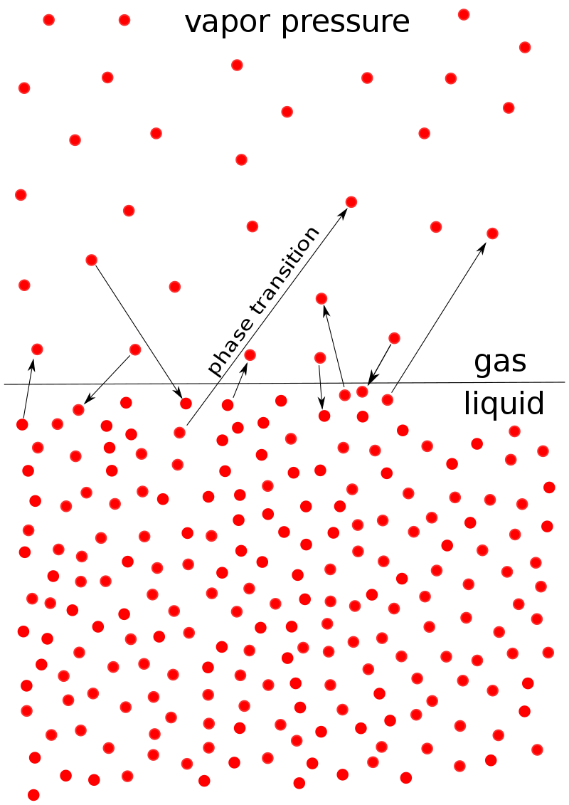

# [{ align=left, width=3.8% }](../../index.md)  Solution | Vapour Pressure of Liquid Solution

## Vapour Pressure

* The pressure exerted by vapours of a liquid over its liquid surface when the liquid and vapours are in equilibrium is known as vapour pressure.
* Equilibrium means the state where rate of vaporization is equal to rate of condensation.

{loading=lazy, width=40%}

Image Credit: [https://en.wikipedia.org/wiki/Vapor_pressure](https://en.wikipedia.org/wiki/Vapor_pressure){:target="_blank"}

## Factors affecting vapour pressure

1. **Nature of liquid:**
     * The liquid having strong attraction forces between its molecules will have lower vapour pressure as compared to other liquids.
     * Example: water has lower vapour pressure as compared to alcohol due to this reason.
2. **Temperature:**
     * On increasing temperature, vapour pressure of liquid will increase and vice-versa.
3. **Surface Area of liquid:**
     * Vapour pressure increases with increase in surface area of liquid and vice-versa.
4. **Purity of solution:**
     * Vapour pressure of pure liquid will always be greater than the vapour pressure of its solution with a non-volatile solid.
     * For example, vapour pressure of pure water is greater than (water + sugar) solution.
