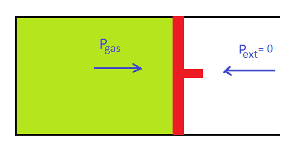

# [{ align=left, width=3.8% }](../../index.md)  Thermodynamics | Analysis of Thermodynamic Processes

## 1. Isochoric Process

* In an isochoric process, volume remains constant.

!!! tip ""

    $$V = constant$$
    
    $$dV = 0$$
    
    $$So,\ work\ done\ by\ gas:$$
    
    $$W = 0$$
    
    $$Using\ first\ law\ of\ thermodynamics:$$
    
    $$&Delta;U = q + W$$
    
    $$q = &Delta;U$$

## 2. Isobaric Process

* In an isobaric process, pressure remains constant.

!!! tip ""
             
    $$P = constant$$
    
    $$W = - \int\limits_{V_1}^{V_2} P_{ext} dV$$
    
    $$Since,\ P_{ext}\ is\ constant:$$
    
    $$W = -P_{ext} (V_2 - V_1) = -P_{ext}&Delta;V$$
    
    $$Using\ first\ law\ of\ thermodynamics:$$
    
    $$&Delta;U = q + W$$
    
    $$&Delta;U = q - P_{ext}&Delta;V$$

## 3. Isothermal Process

* In an isothermal process, temperature remains constant.

!!! tip ""

    $$T = constant$$
    
    $$dT = 0$$
    
    $$Change\ in\ internal\ energy,\ &Delta;U:$$
    
    $$&Delta;U = \int nC_vdT = 0$$
    
    $$Using\ first\ law\ of\ thermodynamics:$$
    
    $$&Delta;U = q + W$$
    
    $$0 = q + W$$
    
    $$q = -W$$

    It means that heat absorbed = work done by the system or work done on the system = heat released.

* Work done by gas in isothermal reversible process:

!!! tip ""
             
    $$W_{rev} = - \int\limits_{V_1}^{V_2} P_{ext}dV$$
    
    $$W_{rev} = - \int\limits_{V_1}^{V_2} {nRT \over V}dV$$
    
    $$W_{rev} = - nRT \int\limits_{V_1}^{V_2} {1 \over V}dV$$
    
    $$W_{rev} = -nRT\ ln{V_2 \over V_1}$$
    
    We know that P is inversely proportional to V. So, we can also write:
    
    $$W_{rev} = -nRT\ ln{P_1 \over P_2}$$

* Work done by gas in isothermal irreversible process:

!!! tip ""
          
    $$W_{irr} = -P_{ext} (V_2 - V_1)$$
    
    $$W_{irr} = -P_{ext} ({nRT \over P_2} - {nRT \over P_1})$$
    
    $$W_{irr} = -P_{ext}nRT ({1 \over P_2} - {1 \over P_1})$$

## 4. Adiabatic Process

* An adiabatic process is a process in which there is no exchange of heat between system and surrounding.

!!! tip ""
    
    $$q = 0$$
    
    $$Using\ first\ law\ of\ thermodynamics:$$
    
    $$&Delta;U = q + W$$
    
    $$&Delta;U = 0 + W$$
    
    $$&Delta;U = W$$

* Work done for an adiabatic Process:

!!! tip ""          

    $$W = &Delta;U$$
    
    $$W = \int\limits_{T_1}^{T_2} nC_vdT$$
    
    $$W = nC_v(T_2 - T_1)$$
    
    If the process is irreversible, we can also calculate work done as:
    
    $$W = -P_{ext}(V_2 - V_1)$$
    
    $$W = -P_{ext}({nRT_2 \over P_2} - {nRT_1 \over P_1})$$

* Equation of state for an adiabatic Process:

!!! tip ""
           
    The equation of state of an adiabatic process can be expressed in three forms as given below -
    
    $$PV^{&gamma;} = constant\ (First\ Form)$$
    
    $$Since,\ V = {nRT \over P}$$
    
    $$V &Proportional; {T \over P}$$
    
    $$P({T \over P})^&gamma; = constant$$
    
    $$P^{1-&gamma;}T^&gamma; = constant\ (Second\ form)$$
    
    $$Since,\ P = {nRT \over V}$$
    
    $$P &Proportional; {T \over V}$$
    
    $$PV^&gamma; = constant$$
    
    $$ {T \over V} V^&gamma; = constant$$
    
    $$TV^{&gamma;-1} = constant\ (Third\ form)$$

* **Joule Thomson Effect:** A gas on adiabatic expansion shows cooling. In other words, the temperature of a gas or a system decreases if the gas is expanded adiabatically.

!!! tip "Proof"        

    In case of expansion, work done is negative:
    
    $$W < 0$$
    
    Since, it is an adiabatic process, q = 0. So, W = &Delta;U
    
    $$&Delta;U < 0$$
    
    $$nC_v(T_2 - T_1) < 0$$
    
    $$T_2 < T_1$$
    
    Thus, final temperature, T2 is less than initial temperature T1. Hence, a gas on adiabatic expansion shows cooling.

## 5. Free Expansion

* Expansion against zero external pressure is known as free expansion.

* In free expansion, work done is zero.

!!! tip ""

    $$W = - \int\limits_{V_1}^{V_2}P_{ext}dV$$
    
    $$W = 0\ (Since,\ P_{ext} = 0)$$

* No heat is supplied or released during free expansion.

!!! tip ""

    $$q = 0$$

* Applying first law of thermodynamics, we can calculate change in internal energy as:

!!! tip ""

    $$&Delta;U = q + W$$
    
    $$&Delta;U = 0$$
    
    $$ \int\limits_{T_2}^{T_1} nC_vdT = 0$$
    
    $$nC_v(T_2 - T_1) = 0$$
    
    $$T_2 = T_1$$
    
    Thus, final temperature = initial temperature
    
    So, in free expansion, temperature does not change.