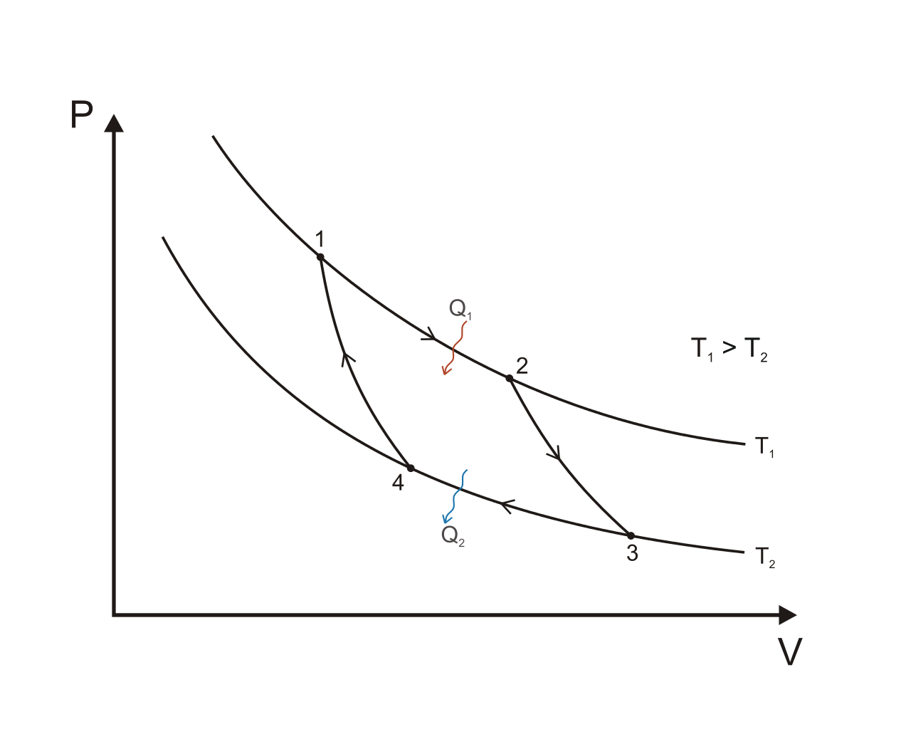
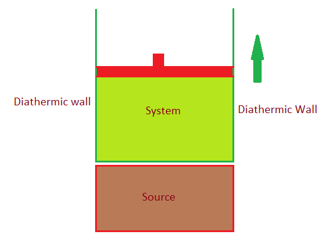
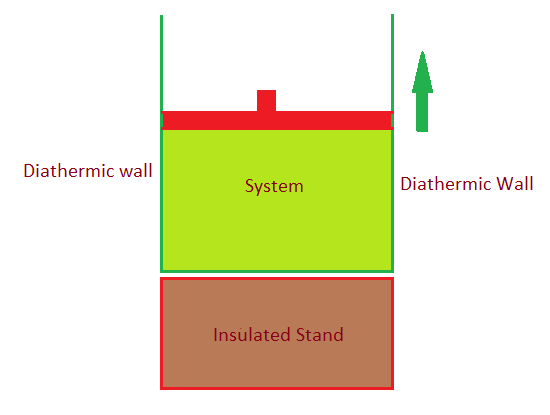
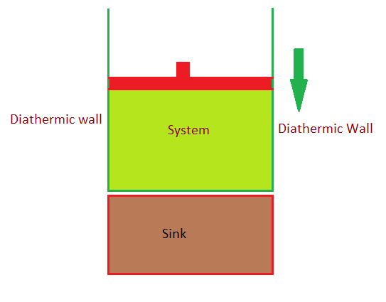
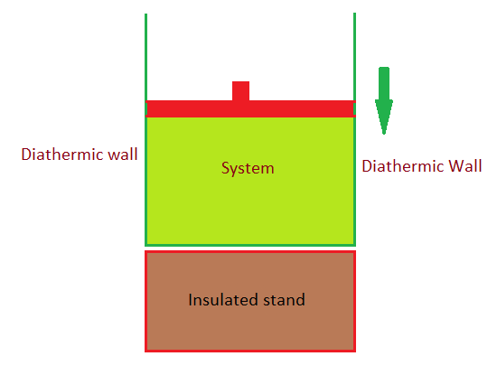

# [{ align=left, width=3.8% }](../../index.md)  Thermodynamics | Carnot Cycle and Second Law of Thermodynamics

## Carnot Cycle

* Carnot cycle is based on first law of thermodynamics. It tells about conversion of heat energy into work.
* Carnot cycle also helps us in defining second law of thermodynamics.
* A Carnot cycle consists of following components: (a) sink, (b) source, (c) insulated stand, (d) gas cylinder (system).
* **Sink:** A sink can absorb any amount of heat released by the system.
* **Source:** A source has infinite thermal conductivity and any amount of heat can be taken from it.
* **Insulated stand:**  An insulated stand is a diathermic substance, ie, no heat can be transferred to or taken from it.
* A carnot cycle consists of four steps: (a) isothermal reversible expansion (b) adiabatic reversible expansion (c) isothermal reversible compression (d) adiabatic reversible compression.
* Carnot cycle is a cyclic process.

## Graphical Representation of carnot cycle

{ loading=lazy }

Image credit: [https://en.wikipedia.org/wiki/Carnot_cycle](https://en.wikipedia.org/wiki/Carnot_cycle){:target="_blank"}

In the above graph, process 1&rarr;2 is reversible isothermal expansion with constant temperature T1. Process 2&rarr;3 is reversible adiabatic expansion. Process 3&rarr;4 is reversible isothermal expansion with constant
temperature T2. Process 4&rarr;1 is reversible adiabatic compression. Let's assume Q1 heat is absorbed from source during process 1&rarr;2 and Q2 heat is released to sink during process 3&rarr;4.

### Step 1. Reversible Isothermal Expansion (Process 1&rarr;2)

{ loading=lazy }

* Let pressure and volume at state 1 be (P1, V1) and at state 2 be (P2, V2).

* Change in internal energy(&Delta;U) is zero because it is isothermal process.

* Work done, W12 is given by:

!!! tip ""

    $$W_{12} = -nRT_1ln{V_2 \over V_1}$$

* Heat absorbed Q1 can be calculated from first law of thermodynamics:

!!! tip ""

    $$&Delta;U = q + W_{12}$$

    $$0 = Q_1 - nRT_1ln{V_2 \over V_1}$$

    $$Q_1 = nRT_1ln{V_2 \over V_1}$$

    Q1 will be positive because V2 > V1, which also indicates that heat is absorbed during this process.

### Step 2. Reversible Adiabatic Expansion (Process 2&rarr;3)

{ loading=lazy }

* Let pressure and volume at state 3 be (P3, V3).

* Change in internal energy(&Delta;U) is given by:

!!! tip ""

    $$&Delta;U = nC_v(T_2 - T_1)$$

* Since, it is an adiabatic process, no heat is absorbed or released.

* Work done, W23 is calculated from first law of thermodynamics:

!!! tip ""

    $$&Delta;U = q + W_{23}$$

    $$nC_v(T_2 - T_1) = 0 + W_{23}$$

    $$W_{23} = nC_v(T_2 - T_1)$$

### Step 3. Reversible Isothermal Compression (Process 3&rarr;4)

{ loading=lazy }

* Let pressure and volume at state 4 be (P4, V4).

* Change in internal energy(&Delta;U) is zero because it is isothermal process.

* Work done, W34 is given by:

!!! tip ""

    $$W_{34} = -nRT_2ln{V_4 \over V_3}$$

* Heat absorbed Q2 can be calculated from first law of thermodynamics:

!!! tip ""

    $$&Delta;U = q + W_{34}$$

    $$0 = Q_2 - nRT_2ln{V_4 \over V_3}$$

    $$Q_2 = nRT_2ln{V_4 \over V_3}$$

    Q2 will be negative because V4 < V3, which also indicates that heat is released during this process.

### Step 4. Reversible Adiabatic Compression (Process 4&rarr;1)

{ loading=lazy }

* Change in internal energy(&Delta;U) is given by:

!!! tip ""

    $$&Delta;U = nC_v(T_1 - T_2)$$

* Since, it is an adiabatic process, no heat is absorbed or released.

* Work done, W23 is calculated from first law of thermodynamics:

!!! tip ""

    $$&Delta;U = q + W_{41}$$

    $$nC_v(T_1 - T_2) = 0 + W_{41}$$

    $$W_{41} = nC_v(T_1 - T_2) $$

    $$W_{41} = -nC_v(T_2 - T_1)$$

### Total Work done in Carnot cycle

* Total work done is given by:

!!! tip ""

    $$W = W_{12} + W_{23} + W_{34} + W_{41}$$

    $$W = -nRT_1ln{V_2 \over V_1} + nC_v(T_2 - T_1) - nRT_2ln{V_4 \over V_3} - nC_v(T_2 - T_1)$$

    $$W = -nR(T_1ln{V_2 \over V_1} + T_2ln{V_4 \over V_3})$$

### Efficiency of carnot cycle

* For adiabatic reversible expansion process 2->3, we can write:

!!! tip ""

    $$T_1V_2^{&gamma;-1} = T_2V_3^{&gamma;-1}$$

* For adiabatic reversible compression process 4->1, we can write:

!!! tip ""

    $$T_1V_1^{&gamma;-1} = T_2V_4^{&gamma;-1}$$

* Dividing above two equations, we get:

!!! tip ""

    $$ {V_2 \over V_1} = {V_3 \over V_4}$$

* Efficiency, &eta; of carnot cycle in terms of temperatures T1 and T2 can be calculated as:

!!! tip ""

    $$&eta; = {|Work\ done| \over Heat\ absorbed}$$

    $$&eta; = {nR(T_1ln{V_2 \over V_1} + T_2ln{V_4 \over V_3}) \over nRT_1ln{V_2 \over V_1}}$$

    $$&eta; = {T_1ln{V_2 \over V_1} - T_2ln{V_3 \over V_4} \over T_1ln{V_2 \over V_1}}$$

    $$Since,\ {V_2 \over V_1} = {V_3 \over V_4},\ we\ can\ write:$$

    $$&eta; = {T_1 - T_2 \over T_1}$$

    Here, T1 = Temperature of source and T2 = Temperature of sink

* Efficiency, &eta; of carnot cycle in terms of Q1 and Q2 can be calculated as:

!!! tip ""

    $$&eta; = {|Work\ done| \over Heat\ absorbed}$$

    $$&eta; = {nR(T_1ln{V_2 \over V_1} + T_2ln{V_4 \over V_3}) \over nRT_1ln{V_2 \over V_1}}$$

    $$&eta; = {Q_1 - Q_2 \over Q_1}$$

* Let us estimate the value of efficiency, &eta;:

!!! tip ""

    $$&eta; = {T_1 - T_2 \over T_1}$$

    $$&eta; = 1 - {T_2 \over T_1}$$

    Here, T2 = Temperature of sink and T1 = Temperature of source. 

    Also, temperature of source, T1 is always greater than temperature of sink, T2.

    So, value of &eta; lies between 0 and 1 but it is never 1.

    $$0 < &eta; < 1$$

    It means only a part of heat absorbed is converted into work. This will help us in defining second law of thermodynamics.

### Entropy change in Carnot Cycle

* Since entropy is a state function and carnot cycle is a cyclic process, so entropy change in carnot cycle will be zero.

## Second Law of Thermodynamics

!!! tip "Claussius Statement"

    It is impossible to convey heat from a cooler body to a hotter body without the help of any external agent.

!!! tip "Kelvin-Planck Statement"

    It is impossible to build an engine which can convert heat completely into work in a complete cycle.
