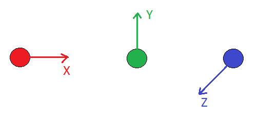
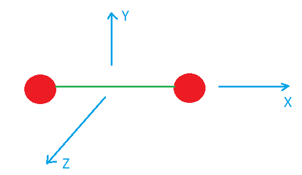
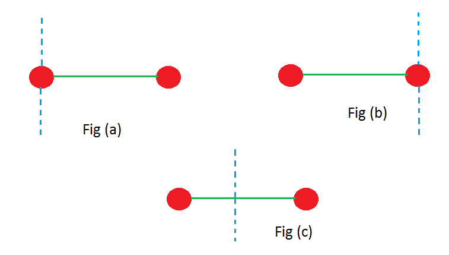
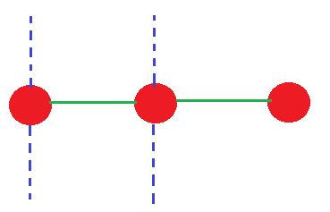
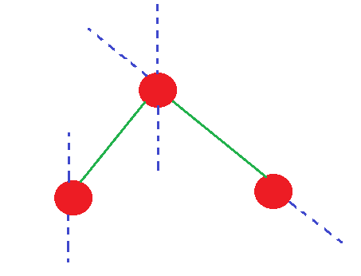

# [{ align=left, width=3.8% }](../../index.md)  Thermodynamics | Degree of Freedom

## Degree of freedom

* Degree of freedom is the number of independent ways by which a system can exchange energy.

* There are three types of degree of freedom:
  * Translational degree of freedom (ftr)
  * Rotational degree of freedom (fr)
  * Vibrational degree of freedom (fv)

* At room temperature, vibrational degree of freedom of a gas is **zero**.

* At high temperature where vibrational degree of freedom is non-zero, total degree of freedom, f = 3N (where, N = atomicity of a gas). For monoatomic gas like He, N = 1, for diatomic gas like O2, N = 2 and for
  triatomic gas like O3, N = 3.

* Cv is related to degree of freedom, f as:

!!! tip ""

    $$C_v = {fR \over 2}$$

    $$Poisson's\ ratio,\ &gamma; = {C_p \over C_v}$$

    $$&gamma; = {C_v + R \over C_v}$$

    $$&gamma; = {{fR \over 2} + R \over {fR \over 2}}$$

    $$&gamma; = 1 + {2 \over f}$$

## Degree of freedom for monoatomic gas

* **Translational degree of freedom:** A monoatomic gas can translate in all three directions: x, y and z. So, ftr = 3

{ loading=lazy }

* **Rotational degree of freedom:** A monoatomic gas cannot rotate because it does not have any external axis. However, it spins about its own axis. So, fr = 0.

* **Vibrational degree of freedom:** At room temperature, vibrational degree of freedom, fv = 0.

* Total degree of freedom, f at room temperature for monoatomic gas:

!!! tip ""

    $$f = f_{tr} + f_r + f_v = 3 + 0 + 0 = 3$$

!!! tip ""

    $$C_v = {fR \over 2} = {3R \over 2}$$

    $$C_p = C_v + R = {{3R \over 2} + R} = {5R \over 2}$$

    $$Poisson's\ ratio,\ &gamma; = {C_p \over C_v} = {5 \over 3}$$

## Degree of freedom for diatomic gas

* **Translational degree of freedom:** A diatomic gas can also traverse in three directions x, y and z. So, ftr = 3.

{ loading=lazy }

* **Rotational degree of freedom:**  A diatomic gas has two external axes. So, its rotational degree of freedom, fr = 2.

{ loading=lazy }

Note that Fig (a) and Fig (b) may look different but they actually represent the same axis because rotation about these axes produce same rotation with one atom at rest and other in motion.

* **Vibrational degree of freedom:** At room temperature, vibrational degree of freedom, fv = 0.

* Total degree of freedom, f at room temperature for diatomic gas:

!!! tip ""

    $$f = f_{tr} + f_r + f_v = 3 + 2 + 0 = 5$$

!!! tip ""

    $$C_v = {fR \over 2} = {5R \over 2}$$

    $$C_p = C_v + R = {5R \over 2} + R = {7R \over 2}$$

    $$Poisson's\ ratio,\ &gamma; = {C_p \over C_v} = {7 \over 5}$$

## Degree of freedom for triatomic linear gas

* **Translational degree of freedom:** A triatomic gas can traverse in all three directions. So, ftr = 3.

* **Rotational degree of freedom:** In a triatomic linear gas, there are two external axes, so fr = 2.

    { loading=lazy }

* **Vibrational degree of freedom:** At room temperature, vibrational degree of freedom, fv = 0.

* Total degree of freedom, f at room temperature for triatomic linear gas:

!!! tip ""

    $$f = f_{tr} + f_r + f_v = 3 + 2 + 0 = 5$$

!!! tip ""

    $$C_v = {fR \over 2} = {5R \over 2}$$

    $$C_p = C_v + R = {5R \over 2} + R = {7R \over 2}$$

    $$Poisson's\ ratio,\ &gamma; = {C_p \over C_v} = {7 \over 5}$$

## Degree of freedom for triatomic non-linear gas

* **Translational degree of freedom:** A triatomic gas can traverse in all three directions. So, ftr = 3.

* **Rotational degree of freedom:** In a triatomic non-linear gas, there are three external axes, so fr = 3.

{ loading=lazy }

* **Vibrational degree of freedom:** At room temperature, vibrational degree of freedom, fv = 0.

* Total degree of freedom, f at room temperature for triatomic non-linear gas:

!!! tip ""

    $$f = f_{tr} + f_r + f_v = 3 + 3 + 0 = 6$$

!!! tip ""

    $$C_v = {fR \over 2} = {6R \over 2} = 3R$$

    $$C_p = C_v + R = 3R + R = 4R$$

    $$Poisson's\ ratio,\ &gamma; = {C_p \over C_v} = {4 \over 3}$$

## Calculation of Vibrational degree of freedom at high temperature

* For any gas, at sufficiently high temperature when vibrational degree of freedom cannot be ignored:

!!! tip ""

    $$Total\ degree\ of\ freedom,\ f = 3N$$

    $$where\ N = atomicity of gas$$

* Vibrational degree of freedom, fv is given by:

!!! tip ""

    $$f_v = f - (f_{tr} + f_r) = 3N - (f_{tr} + f_r)$$

    $$where\ f_{tr} = translational\ degree\ of\ freedom$$

    $$and,\ f_r = rotational\ degree\ of\ freedom$$

* For monoatomic gas:

!!! tip ""

    $$f_v = 3N - (f_{tr} + f_r) = 3 \times 1 - (3 + 0) = 0 $$

* For diatomic gas:

!!! tip ""

    $$f_v = 3N - (f_{tr} + f_r) = 3 \times 2 - (3 + 2) = 1 $$

* For triatomic linear gas:

!!! tip ""

    $$f_v = 3N - (f_{tr} + f_r) = 3 \times 3 - (3 + 2) = 4 $$

* For triatomic non-linear gas:

!!! tip ""

    $$f_v = 3N - (f_{tr} + f_r) = 3 \times 3 - (3 + 3) = 3 $$
