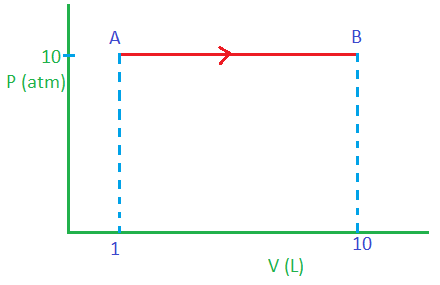
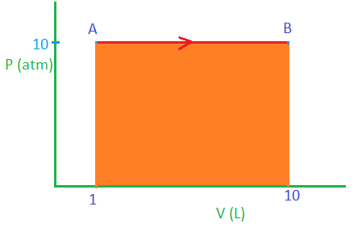
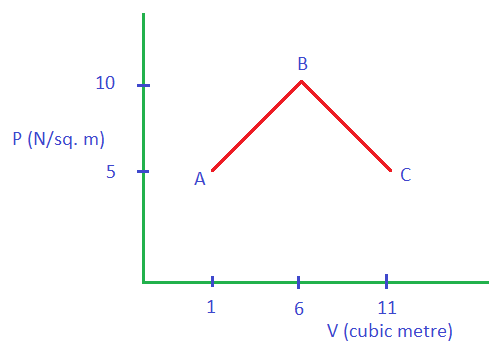
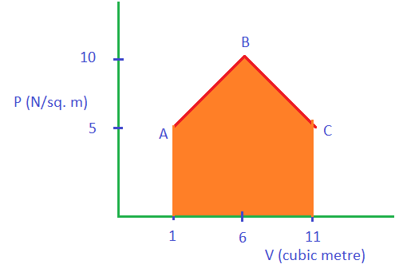
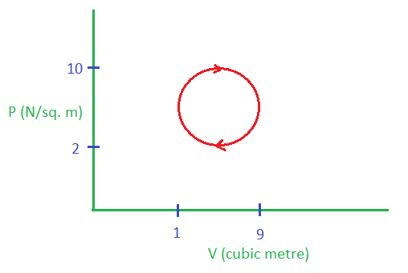
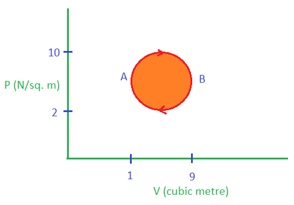
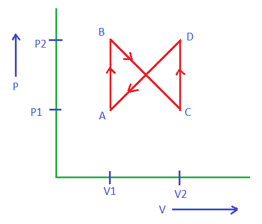

# [{ align=left, width=3.8% }](../../index.md)  Thermodynamics | Graph Based Questions

## Questions

!!! tip "Note"

    Please note that in all the questions discussed below, we should assume that the process is reversible because only in case of reversible process, we can calculate work done by finding area under P-V curve (because
    Pext will be approximately equal to Pgas).

??? question "In the process shown in the form of graph where a gas expands from 1 L to 10 L, if heat supplied to the gas is 100 J, calculate the change in internal energy. (Take 1 atm L = 100 J)  { loading=lazy }"

    We know that work done can be calculated by finding area under P-V curve.

    { loading=lazy }

    Since, this is expansion, work done will be negative.

    $$W = - Area\ under\ P-V\ curve$$

    $$W = - (10 \times (10-1))$$

    $$W = -10 \times 9 = 90\ atm\ L$$

    $$W = -90 \times 100 = -9000\ J$$

    Change in internal energy, &Delta;U can be calculated by first law of thermodynamics. Here, q will be positive because heat is **supplied**.

    $$&Delta;U = q + W$$

    $$&Delta;U = (100 - 9000)\ J$$

    $$ &Delta;U = -8900\ J $$

??? question "In the process shown in the form of graph, if change in internal energy is 100 J, calculate q for the process.  { loading=lazy }"

    We know that work done can be calculated by finding area under P-V curve.

    { loading=lazy }

    Since, this is expansion, work done will be negative.

    $$W = - Area\ under\ P-V\ curve$$

    $$W = - (Area\ of\ triangle + Area\ of\ rectangle)$$

    $$W = - ({1 \over 2} \times 10 \times 5 + 10 \times 5)$$

    $$W = -75 J$$

    q can be calculated using first law of thermodynamics:

    $$&Delta;U = q + W$$

    $$100 = q - 75\ J$$

    $$ q = 175\ J $$

??? question "For the process shown below, calculate: (a) W (b) &Delta;U (c) q.   { loading=lazy }"

    We know that work done can be calculated by finding area under P-V curve.

    { loading=lazy }

    Since, this is a cyclic process and graph is clockwise, work done will be negative. (It is because area under expansion curve from A to B is greater than the area under compression curve from B to A).

    $$W = - Area\ under\ P-V\ curve$$

    $$W = - &pi; \times 4^2$$

    $$W = -16&pi;\ J$$

    Since, this is a cyclic process, &Delta;U = 0 (because internal energy is a state function)

    q can be calculated from first law of thermodynamics:

    $$&Delta;U = q + W$$

    $$0 = q - 16&pi;\ J$$

    $$ q = 16&pi;\ J $$

??? question "For the process shown below, calculate: (a) W (b) &Delta;U (c) q.   { loading=lazy }"

    We know that work done can be calculated by finding area under P-V curve.

    Work done in the path AB is 0 because it is isochoric process:

    $$W_{AB} = 0$$

    Work done in path BC (expansion):

    $$W_{BC} = - Area\ of\ curve\ V_1BCV_2$$

    $$W_{BC} = - {1 \over 2} (P_2 - P_1) (V_2 - V_1) - (V_2 - V_1) P_1$$

    $$W_{BC} = - {1 \over 2} (V_2 - V_1) (P_2 - P_1 + P_1)$$

    $$W_{BC} = - {1 \over 2} (V_2 - V_1) P_2$$

    Work done in the path CD is 0 because it is isochoric process:

    $$W_{CD} = 0$$

    Work done in path DA (compression):

    $$W_{DA} = Area\ of\ curve\ V_2DAV_1$$

    $$W_{DA} = {1 \over 2} (P_2 - P_1) (V_2 - V_1) - (V_2 - V_1) P_1$$

    $$W_{DA} = {1 \over 2} (V_2 - V_1) (P_2 - P_1 + P_1)$$

    $$W_{DA} = {1 \over 2} (V_2 - V_1) P_2$$

    Total work done in the process:

    $$W_{total} = W_{AB} + W_{BC} + W_{CD} + W{DA}$$

    $$W_{total} = 0 - {1 \over 2} (V_2 - V_1) P_2 + 0 + {1 \over 2} (V_2 - V_1) P_2$$

    $$W_{total} = 0$$
