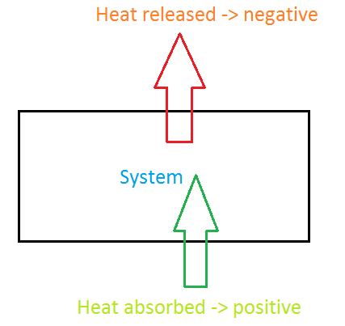
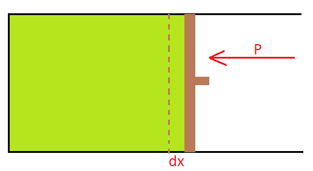

# [{ align=left, width=3.8% }](../../index.md)  Thermodynamics | Heat, Work and Internal Energy

## Heat (q)

* Heat is a form of energy, which flows due to difference in temperature.
* It flows from high temperature to low temperature.
* Heat is a path function, ie, it depends on the path followed by the system to reach to the current state.
* **Sign convention:** Heat absorbed by the system is taken as positive and heat released by the system is taken as negative.

## Work (W)

* Work is a mode of transfer of energy. Work can be done either through expansion or compression.

* Work is a path function, ie, it depends on the actual path followed by the system to reach the current state.

* **Sign convention:** Work done by the system is negative and work done on the system is positive.

* In expansion, work is done by the system, so work done is negative. In compression, work is done on the system, so work done is positive.

* Work done by the system is calculated as:

!!! tip ""

    $$dW = -Fdx$$
    
    Here, we have negative sign because direction of external force, F and displacement dx is opposite.
    
    $$Since,\ F = Pressure \times Area$$
    
    $$dW = -PAdx$$
    
    $$dW = -PdV$$
    
    $$Integrating\ both\ sides:$$
    
    $$\int dW = -\int\limits_{V_1}^{V_2} PdV$$
    
    $$W = -\int\limits_{V_1}^{V_2} PdV$$
    
    Here, since P is the external pressure, we can say that work done by the system is:
    
    $$W = -\int\limits_{V_1}^{V_2} P_{ext}dV$$

* Since the geometrical meaning of integration is finding area under curve, so we can also calculate work done by finding area under P-V curve (for a reversible process in which Pext is approximately equal to
  Pgas). We will discuss reversible process later.

## Internal Energy (U)

* The sum of all possible kinds of energy present in the system is called its internal energy.
* Thus, internal energy constitutes kinetic energy, potential energy, electronic energy, nuclear energy, rotational energy, vibrational energy etc.
* Internal energy is a state function, ie, it depends only on initial and final state of the system.
* For a cyclic process, &Delta;U = 0
* It is an extensive property, ie, it depends on amount of matter present in the system.

### Calculation of internal energy

* Internal energy can be expressed as a function of volume and temperature.

!!! tip ""

    $$U = f(V,T)$$
    
    $$dU = {({dU \over dV})}_TdV + {({dU \over dT})}_VdT$$
    
    $$where,\ {({dU \over dV})}_T = Change\ in\ U\ w.r.t\ V\ at\ constant\ T$$
    
    $$and,\ {({dU \over dT})}_V = Change\ in\ U\ w.r.t\ T\ at\ constant\ V$$

* For an ideal gas, volume cannot be changed at constant temperature because there is no force of attraction or repulsion existing between two ideal gas molecules.

!!! tip ""

    $$So,\ {({dU \over dV})}_T = 0$$

* Thus, for an ideal gas, we can write:

!!! tip ""

    $$dU = {({dU \over dV})}_T dT$$

* For one mole of ideal gas:

!!! tip ""

    $$C_v = {({dU \over dV})}_T$$
    
    $$Hence,\ dU = C_vdT$$

* For n moles of ideal gas:

!!! tip ""

    $$dU = nC_vdT$$
    
    $$Integrating\ both\ sides:$$
    
    $$&Delta;U = \int\limits_{T_1}^{T_2} nC_vdT$$
    
    $$If\ C_v\ is\ independent\ of\ temperature:$$
    
    $$&Delta;U = nC_v(T_2 - T_1)$$

    $$where,\ C_v = Molar\ heat\ capacity\ at\ constant\ volume

!!! note "Note"

    * For a cyclic process, &Delta;U = 0.
    * For an isothermal process, &Delta;U = 0 (Since, T2 = T1).

