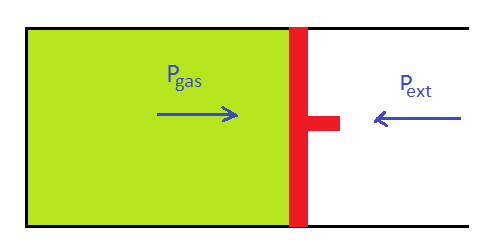

# [{ align=left, width=3.8% }](../../index.md)  Thermodynamics | Reversible and Irreversible Processes

## Irreversible Process

* An irreversible process is a type of process in which the driving force is much greater than the opposing force.

* It is a very fast process and takes a very little time to complete.

* In case of irreversible expansion, Pgas is much greater than Pext (Pgas >> Pext).

* In case of irreversible compression, Pext is much greater than Pgas (Pext >> Pgas).

* Work done in an irreversible process is given by:

!!! tip ""

    $$W_{irr} = - \int\limits_{V_1}^{V_2} P_{ext}dV$$
    
    Since, irreversible processes take place against constant external pressure.
    
    $$W_{irr} = -P_{ext}(V_2 - V_1)$$
    
    $$W_{irr} = -P_{ext}&Delta;V$$

## Reversible Process

* In a reversible process, the driving force is infinitesimally greater than the opposing force.

* If the opposing force is increased by an infinitesimally small amount, the process returns back to its previous state. Therefore, it is called reversible.

* Reversible processes are generally very slow processes.
  

* For a reversible expansion, Pgas is infinitesimally greater than Pext.

* For a reversible compression, Pext is infinitesimally greater than Pgas.

* In general, we can write: Pext &thickapprox; Pgas

* Work done in a reversible process is given by:

!!! tip ""

    $$W_{rev} = - \int\limits_{V_1}^{V_2} P_{ext}dV$$
    
    Since, Pext &thickapprox; Pgas, we can write:
    
    $$W_{rev} = - \int\limits_{V_1}^{V_2} P_{gas}dV$$
    
