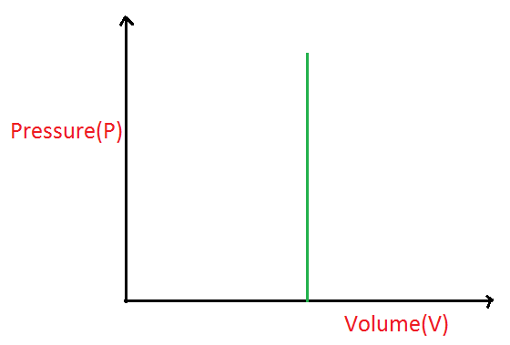
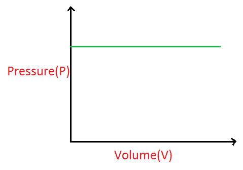
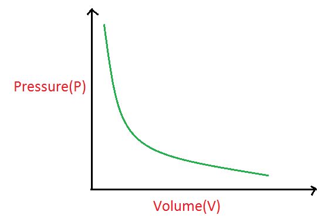
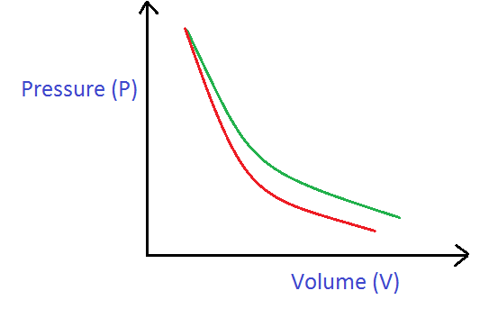
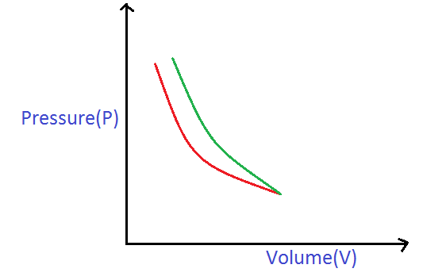

# [{ align=left, width=3.8% }](../../index.md)  Thermodynamics | Thermodynamic Processes

A Thermodynamic process is a process in which the thermodynamic state of a system is changed.

## 1. Isochoric Process

* In an isochoric process, volume remains constant.

!!! tip ""

    $$V = constant$$

    $$Change\ in\ volume\ (&Delta;V) = 0$$

{ loading=lazy }

## 2. Isobaric Process

* Pressure is constant throughout an isobaric process.

!!! tip ""

    $$P = constant$$

    $$Change\ in\ Pressure\ (&Delta;P) = 0$$

{ loading=lazy }

## 3. Isothermal Process

* In an isothermal process, temperature remains constant.

!!! tip ""

    $$T = constant$$

    $$Change\ in\ temperature\ (&Delta;T) = 0$$

    $$Also,\ PV = nRT$$

    $$Since,\ T = constant$$

    $$P\ &Proportional;\ {1 \over V}$$

    $$Or,\ PV = constant$$

{ loading=lazy }

## 4. Adiabatic Process

* In an adiabatic process, there is no exchange of heat between system and surrounding.

* The equation of an adiabatic process is given by:

!!! tip ""

    $$PV^&gamma; = constant$$

    $$where,\ &gamma; = Poisson's\ ratio$$

* We will discuss Poisson's ratio later. Note that &gamma; is always greater than or equal to 1.

{ loading=lazy }

## 5. Cyclic Process

* A cyclic process is one in which a system returns to the initial state after going through different steps.

* For a cyclic process, change in the value of a state function is always zero because state functions depend on initial and final state of the system and not on the path followed by the system.

## How to distinguish between isothermal curve and adiabatic curve?

**Key Concept:** Adiabatic curves are steeper as compared to isothermal curves at same temperature.

### Example 1:

{ loading=lazy }

* Here, red curve is steeper so it is adiabatic and green curve is isothermal.

#### Proof:

!!! tip ""

    $$Here,\ slope\ of\ graph = {dP \over dV}$$

    $$For\ isothermal\ process:$$

    $$PV = constant$$

    $$PdV + VdP = 0$$

    $$ {dP \over dV} = {-P \over V}$$

    $$For\ adiabatic\ process:$$

    $$PV^&gamma; = constant$$

    $$P&gamma;V^{&gamma;-1}dV + V^&gamma;dP = 0$$

    $$ {dP \over dV} = {-P&gamma; \over V} $$

* Seeing the slopes of both isothermal and adiabatic curves as calculated above, we can safely infer that adiabatic curves are steeper because &gamma; is always greater than or equal to 1.

### Example 2:

{ loading=lazy }

* Here, green curve is steeper, so it is adiabatic and the red curve is isothermal.
